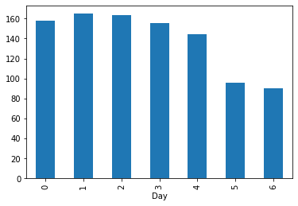
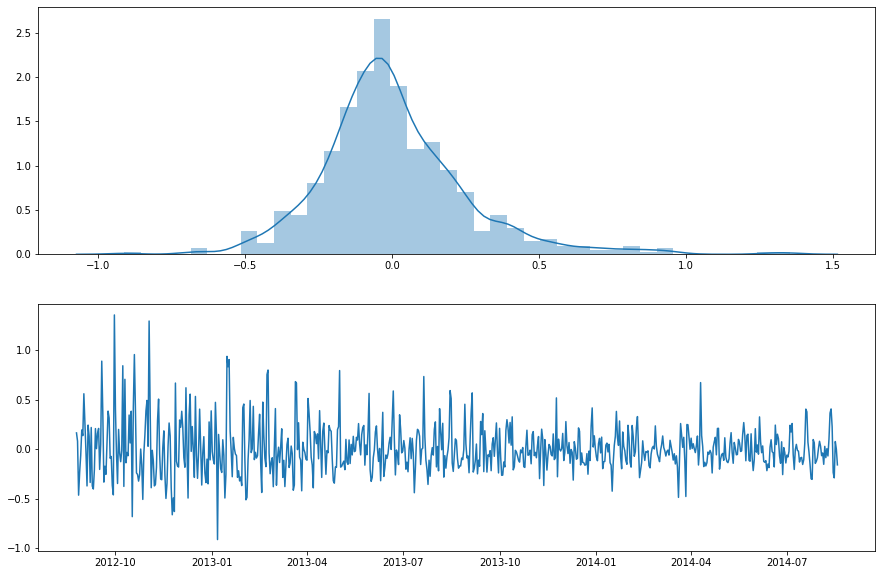

# INTRODUCTION

This is a data science competition held by Analytics Vidhya for anyone wanting to predict the future using time series methods.

Unicorn startup fund is considering making an investment in a new form of transportation - JetRail. JetRail uses Jet propulsion technology to run rails and move people at a high speed! While JetRail has mastered the technology and they hold the patent for their product, the investment would only make sense, if they can get more than 1 Million monthly users with in next 18 months.
 
I need to help Unicorn ventures with the decision. They usually invest in B2C start-ups less than 4 years old looking for pre-series A funding. In order to help Unicorn Ventures in their decision, I need to forecast the traffic on JetRail for the next 7 months. 

To achieve this goal, I aims at implementing 2 common traditional Time Series method: Exponential Smoothing and SARIMA. Facebook Prophet is also experimented since I think this is a useful tool for data analysts with limited experience and technical expertise in time series forecasting.

# Key Findings and Rooms for Improvement

- Hourly instances create noises for prediction and model learning, thus it is better to forecast at monthly level and convert back to hourly data afterwards.
- Monthly commuters of JetRail from 2015 Feb onwards may reach more than 1 MM people, indicating a feasible investment for Unicorn.
- My prediction accuracy, based on RMSE, is within the top 10% of Analytics Vidhya public leaderboard, although I only used Exponential Smoothing as the final model to predict future traffic. Sometimes, more simple methods may bring better results than complicated approaches.
- Since there is little information about the cities in which Jet Rail operates and other demographic variables, I could only perform a univariate analysis. Obviously there should be more exgoneous features incorporated into the models, e.g. holidays, total predicted population or growth of other transportation modes.


# IMPORT BASIC PACKAGES

```python
import warnings
warnings.filterwarnings('ignore')

import numpy as np
import pandas as pd
import matplotlib.pyplot as plt
import seaborn as sns


```

# Data Cleaning and Feature Extraction


```python
train_original=pd.read_csv('Train_SU63ISt.csv')
test_original=pd.read_csv('Test_0qrQsBZ.csv')
```

I will create copy of both train and test data so as not to impair the original ones.


```python
train=train_original.copy()
test=test_original.copy()
```


```python
train.head()
```


<table border="1" class="dataframe">
  <thead>
    <tr style="text-align: right;">
      <th></th>
      <th>ID</th>
      <th>Datetime</th>
      <th>Count</th>
    </tr>
  </thead>
  <tbody>
    <tr>
      <th>0</th>
      <td>0</td>
      <td>25-08-2012 00:00</td>
      <td>8</td>
    </tr>
    <tr>
      <th>1</th>
      <td>1</td>
      <td>25-08-2012 01:00</td>
      <td>2</td>
    </tr>
    <tr>
      <th>2</th>
      <td>2</td>
      <td>25-08-2012 02:00</td>
      <td>6</td>
    </tr>
    <tr>
      <th>3</th>
      <td>3</td>
      <td>25-08-2012 03:00</td>
      <td>2</td>
    </tr>
    <tr>
      <th>4</th>
      <td>4</td>
      <td>25-08-2012 04:00</td>
      <td>2</td>
    </tr>
  </tbody>
</table>
</div>


```python
train.tail()
```


<div>

<table border="1" class="dataframe">
  <thead>
    <tr style="text-align: right;">
      <th></th>
      <th>ID</th>
      <th>Datetime</th>
      <th>Count</th>
    </tr>
  </thead>
  <tbody>
    <tr>
      <th>18283</th>
      <td>18283</td>
      <td>25-09-2014 19:00</td>
      <td>868</td>
    </tr>
    <tr>
      <th>18284</th>
      <td>18284</td>
      <td>25-09-2014 20:00</td>
      <td>732</td>
    </tr>
    <tr>
      <th>18285</th>
      <td>18285</td>
      <td>25-09-2014 21:00</td>
      <td>702</td>
    </tr>
    <tr>
      <th>18286</th>
      <td>18286</td>
      <td>25-09-2014 22:00</td>
      <td>580</td>
    </tr>
    <tr>
      <th>18287</th>
      <td>18287</td>
      <td>25-09-2014 23:00</td>
      <td>534</td>
    </tr>
  </tbody>
</table>
</div>


First I need to convert column Datetime to Date-Time type


```python
train['Datetime']=pd.to_datetime(train.Datetime,format='%d-%m-%Y %H:%M')
test['Datetime']=pd.to_datetime(test.Datetime,format='%d-%m-%Y %H:%M')
```


```python
train
```


<table border="1" class="dataframe">
  <thead>
    <tr style="text-align: right;">
      <th></th>
      <th>ID</th>
      <th>Datetime</th>
      <th>Count</th>
    </tr>
  </thead>
  <tbody>
    <tr>
      <th>0</th>
      <td>0</td>
      <td>2012-08-25 00:00:00</td>
      <td>8</td>
    </tr>
    <tr>
      <th>1</th>
      <td>1</td>
      <td>2012-08-25 01:00:00</td>
      <td>2</td>
    </tr>
    <tr>
      <th>2</th>
      <td>2</td>
      <td>2012-08-25 02:00:00</td>
      <td>6</td>
    </tr>
    <tr>
      <th>3</th>
      <td>3</td>
      <td>2012-08-25 03:00:00</td>
      <td>2</td>
    </tr>
    <tr>
      <th>4</th>
      <td>4</td>
      <td>2012-08-25 04:00:00</td>
      <td>2</td>
    </tr>
    <tr>
      <th>...</th>
      <td>...</td>
      <td>...</td>
      <td>...</td>
    </tr>
    <tr>
      <th>18283</th>
      <td>18283</td>
      <td>2014-09-25 19:00:00</td>
      <td>868</td>
    </tr>
    <tr>
      <th>18284</th>
      <td>18284</td>
      <td>2014-09-25 20:00:00</td>
      <td>732</td>
    </tr>
    <tr>
      <th>18285</th>
      <td>18285</td>
      <td>2014-09-25 21:00:00</td>
      <td>702</td>
    </tr>
    <tr>
      <th>18286</th>
      <td>18286</td>
      <td>2014-09-25 22:00:00</td>
      <td>580</td>
    </tr>
    <tr>
      <th>18287</th>
      <td>18287</td>
      <td>2014-09-25 23:00:00</td>
      <td>534</td>
    </tr>
  </tbody>
</table>
<p>18288 rows × 3 columns</p>
</div>


The train dataset contains traffic data by hour in 2 years. Column Count indicates the number of people using JetRail within the specified period


```python
test
```


<table border="1" class="dataframe">
  <thead>
    <tr style="text-align: right;">
      <th></th>
      <th>ID</th>
      <th>Datetime</th>
    </tr>
  </thead>
  <tbody>
    <tr>
      <th>0</th>
      <td>18288</td>
      <td>2014-09-26 00:00:00</td>
    </tr>
    <tr>
      <th>1</th>
      <td>18289</td>
      <td>2014-09-26 01:00:00</td>
    </tr>
    <tr>
      <th>2</th>
      <td>18290</td>
      <td>2014-09-26 02:00:00</td>
    </tr>
    <tr>
      <th>3</th>
      <td>18291</td>
      <td>2014-09-26 03:00:00</td>
    </tr>
    <tr>
      <th>4</th>
      <td>18292</td>
      <td>2014-09-26 04:00:00</td>
    </tr>
    <tr>
      <th>...</th>
      <td>...</td>
      <td>...</td>
    </tr>
    <tr>
      <th>5107</th>
      <td>23395</td>
      <td>2015-04-26 19:00:00</td>
    </tr>
    <tr>
      <th>5108</th>
      <td>23396</td>
      <td>2015-04-26 20:00:00</td>
    </tr>
    <tr>
      <th>5109</th>
      <td>23397</td>
      <td>2015-04-26 21:00:00</td>
    </tr>
    <tr>
      <th>5110</th>
      <td>23398</td>
      <td>2015-04-26 22:00:00</td>
    </tr>
    <tr>
      <th>5111</th>
      <td>23399</td>
      <td>2015-04-26 23:00:00</td>
    </tr>
  </tbody>
</table>
<p>5112 rows × 2 columns</p>
</div>


In order to explore some time features of the dataset, I will extract information about weekday, weekends and hours. This can be done using dt feature in pandas


```python
train['Day']=train.Datetime.dt.weekday
#Monday=0 and Sunday=6. Thus 5,6 are weekends
train['Month']=train.Datetime.dt.month
train['Hour']=train.Datetime.dt.hour
train['Year']=train.Datetime.dt.year
```

I also create a feature called week of month (1 for the 1st week in the month) in order to check any seasonality related to monthly component


```python
def add_week_of_month(df):
    import math
    df['week_in_month'] = pd.to_numeric(df.Datetime.dt.day/7)
    df['week_in_month'] = df['week_in_month'].apply(lambda x: math.ceil(x))
    return df
add_week_of_month(train)
```


<table border="1" class="dataframe">
  <thead>
    <tr style="text-align: right;">
      <th></th>
      <th>ID</th>
      <th>Datetime</th>
      <th>Count</th>
      <th>Day</th>
      <th>Month</th>
      <th>Hour</th>
      <th>Year</th>
      <th>week_in_month</th>
    </tr>
  </thead>
  <tbody>
    <tr>
      <th>0</th>
      <td>0</td>
      <td>2012-08-25 00:00:00</td>
      <td>8</td>
      <td>5</td>
      <td>8</td>
      <td>0</td>
      <td>2012</td>
      <td>4</td>
    </tr>
    <tr>
      <th>1</th>
      <td>1</td>
      <td>2012-08-25 01:00:00</td>
      <td>2</td>
      <td>5</td>
      <td>8</td>
      <td>1</td>
      <td>2012</td>
      <td>4</td>
    </tr>
    <tr>
      <th>2</th>
      <td>2</td>
      <td>2012-08-25 02:00:00</td>
      <td>6</td>
      <td>5</td>
      <td>8</td>
      <td>2</td>
      <td>2012</td>
      <td>4</td>
    </tr>
    <tr>
      <th>3</th>
      <td>3</td>
      <td>2012-08-25 03:00:00</td>
      <td>2</td>
      <td>5</td>
      <td>8</td>
      <td>3</td>
      <td>2012</td>
      <td>4</td>
    </tr>
    <tr>
      <th>4</th>
      <td>4</td>
      <td>2012-08-25 04:00:00</td>
      <td>2</td>
      <td>5</td>
      <td>8</td>
      <td>4</td>
      <td>2012</td>
      <td>4</td>
    </tr>
    <tr>
      <th>...</th>
      <td>...</td>
      <td>...</td>
      <td>...</td>
      <td>...</td>
      <td>...</td>
      <td>...</td>
      <td>...</td>
      <td>...</td>
    </tr>
    <tr>
      <th>18283</th>
      <td>18283</td>
      <td>2014-09-25 19:00:00</td>
      <td>868</td>
      <td>3</td>
      <td>9</td>
      <td>19</td>
      <td>2014</td>
      <td>4</td>
    </tr>
    <tr>
      <th>18284</th>
      <td>18284</td>
      <td>2014-09-25 20:00:00</td>
      <td>732</td>
      <td>3</td>
      <td>9</td>
      <td>20</td>
      <td>2014</td>
      <td>4</td>
    </tr>
    <tr>
      <th>18285</th>
      <td>18285</td>
      <td>2014-09-25 21:00:00</td>
      <td>702</td>
      <td>3</td>
      <td>9</td>
      <td>21</td>
      <td>2014</td>
      <td>4</td>
    </tr>
    <tr>
      <th>18286</th>
      <td>18286</td>
      <td>2014-09-25 22:00:00</td>
      <td>580</td>
      <td>3</td>
      <td>9</td>
      <td>22</td>
      <td>2014</td>
      <td>4</td>
    </tr>
    <tr>
      <th>18287</th>
      <td>18287</td>
      <td>2014-09-25 23:00:00</td>
      <td>534</td>
      <td>3</td>
      <td>9</td>
      <td>23</td>
      <td>2014</td>
      <td>4</td>
    </tr>
  </tbody>
</table>
<p>18288 rows × 8 columns</p>
</div>


Finally, I will create a column called Weekday to differentiate normal days and weekends. The assumption is that traffic will become lower during Saturdays and Sundays since fewer people will commute to work.


```python
def weekday(dt):
    if dt['Day']==5 or dt['Day']==6:
        return 0
    else:
        return 1
    
train['Weekday']=train.apply(weekday,axis=1)
```


```python
train.set_index('Datetime',inplace=True)
```


```python
train.drop(['ID'],axis=1,inplace=True)
```


```python
train
```


<table border="1" class="dataframe">
  <thead>
    <tr style="text-align: right;">
      <th></th>
      <th>Count</th>
      <th>Day</th>
      <th>Month</th>
      <th>Hour</th>
      <th>Year</th>
      <th>week_in_month</th>
      <th>Weekday</th>
    </tr>
    <tr>
      <th>Datetime</th>
      <th></th>
      <th></th>
      <th></th>
      <th></th>
      <th></th>
      <th></th>
      <th></th>
    </tr>
  </thead>
  <tbody>
    <tr>
      <th>2012-08-25 00:00:00</th>
      <td>8</td>
      <td>5</td>
      <td>8</td>
      <td>0</td>
      <td>2012</td>
      <td>4</td>
      <td>0</td>
    </tr>
    <tr>
      <th>2012-08-25 01:00:00</th>
      <td>2</td>
      <td>5</td>
      <td>8</td>
      <td>1</td>
      <td>2012</td>
      <td>4</td>
      <td>0</td>
    </tr>
    <tr>
      <th>2012-08-25 02:00:00</th>
      <td>6</td>
      <td>5</td>
      <td>8</td>
      <td>2</td>
      <td>2012</td>
      <td>4</td>
      <td>0</td>
    </tr>
    <tr>
      <th>2012-08-25 03:00:00</th>
      <td>2</td>
      <td>5</td>
      <td>8</td>
      <td>3</td>
      <td>2012</td>
      <td>4</td>
      <td>0</td>
    </tr>
    <tr>
      <th>2012-08-25 04:00:00</th>
      <td>2</td>
      <td>5</td>
      <td>8</td>
      <td>4</td>
      <td>2012</td>
      <td>4</td>
      <td>0</td>
    </tr>
    <tr>
      <th>...</th>
      <td>...</td>
      <td>...</td>
      <td>...</td>
      <td>...</td>
      <td>...</td>
      <td>...</td>
      <td>...</td>
    </tr>
    <tr>
      <th>2014-09-25 19:00:00</th>
      <td>868</td>
      <td>3</td>
      <td>9</td>
      <td>19</td>
      <td>2014</td>
      <td>4</td>
      <td>1</td>
    </tr>
    <tr>
      <th>2014-09-25 20:00:00</th>
      <td>732</td>
      <td>3</td>
      <td>9</td>
      <td>20</td>
      <td>2014</td>
      <td>4</td>
      <td>1</td>
    </tr>
    <tr>
      <th>2014-09-25 21:00:00</th>
      <td>702</td>
      <td>3</td>
      <td>9</td>
      <td>21</td>
      <td>2014</td>
      <td>4</td>
      <td>1</td>
    </tr>
    <tr>
      <th>2014-09-25 22:00:00</th>
      <td>580</td>
      <td>3</td>
      <td>9</td>
      <td>22</td>
      <td>2014</td>
      <td>4</td>
      <td>1</td>
    </tr>
    <tr>
      <th>2014-09-25 23:00:00</th>
      <td>534</td>
      <td>3</td>
      <td>9</td>
      <td>23</td>
      <td>2014</td>
      <td>4</td>
      <td>1</td>
    </tr>
  </tbody>
</table>
<p>18288 rows × 7 columns</p>
</div>


# Data Exploration

First, let's look at the overall data


```python
plt.figure(figsize=(15,5))
plt.ylabel('Number of passengers using Jet Rail/hour')
plt.plot(train.Count)
```


    [<matplotlib.lines.Line2D at 0x24d80405688>]


There is a noticeable growth in number of passengers using Jet Rail over years.


```python
#Look at average traffic per hour
train.groupby('Day')['Count'].mean().plot.bar()
```


    <AxesSubplot:xlabel='Day'>





Just as common sense, fewer people will go on weekends. However, we will check this pattern over a 1-year period. Since 2013 is the only year with complete data, I will look at this one


```python
start=train.index.get_loc('2013-01-01 00:00:00')
start
```


    3096


```python
end=train.index.get_loc('2013-12-31 00:00:00')
end
```


    11832


```python
to_view=train.iloc[start:end,:]
```


```python
plt.figure(figsize=(25,15))
to_view.groupby(['Month','Day'])['Count'].mean().plot.bar()
```


    <AxesSubplot:xlabel='Month,Day'>


We can easily find that our data has weekly seasonality, in which traffic rises up from Monday to Friday, peaking at either Wednesday or Thursday, then reduces on Saturday and Sunday.

Now look at traffic by month


```python
train.groupby('Month')['Count'].mean().plot.bar(color='orange')
```


    <AxesSubplot:xlabel='Month'>


The average traffic in the last quarter is very low. However, be aware of this since our dataset only begins from 25/8/2012 to 25/9/2014


```python
plt.figure(figsize=(15,10))
train.groupby(['Year','Month'])['Count'].mean().plot()
```


    <AxesSubplot:xlabel='Year,Month'>


We can see that we do not have any data value for October 2014 onwards, while the average value of 9,10,11 in 2012 is very low. Thus, the means of 10,11 and 12 are much smaller than those of the other months.

I cannot detect a clear trend of yearly seasonality here. It seems that the traffic keeps increasing month by month rather than an annual repeating pattern

I also try to explore whether data has any monthly seasonality; however, the pattern is rather random and does not indicate any explicit movement.


```python
plt.figure(figsize=(30,20))
train.iloc[11856:,:].groupby(['Month','week_in_month'])['Count'].mean().plot.bar(color='red')
```


    <AxesSubplot:xlabel='Month,week_in_month'>


How about hourly data?


```python
train.groupby('Hour')['Count'].mean().plot.bar(color='orange')
```


    <AxesSubplot:xlabel='Hour'>


It is interesting that the traffic will peak at 10-11am and remain constant unitl 7PM. 
I first expect to see a jump at around 8-9AM, the time when most people commute to work. However, it is not the case here

Let's check if we have data available for all hour units


```python
sns.countplot(train.Hour)
```


    <AxesSubplot:xlabel='Hour', ylabel='count'>


Looking at daywise data shows us that the mean of traffic will be higher in weekdays and lower during weekends


```python
train.groupby('Weekday')['Count'].mean().plot.bar(color='orange')
```


    <AxesSubplot:xlabel='Weekday'>


Finally, I will observe data in hourly, daily, weekly and monthly-wise


```python
hourly=train.resample('H').sum()
daily=train.resample('D').sum()
weekly=train.resample('W').sum()
monthly=train.resample('M').sum()


fig,ax = plt.subplots(4,1,figsize=(20,15))

ax[0].plot(hourly.Count,label='Hourly')
ax[0].legend(loc='upper left')

ax[1].plot(daily.Count,label='Daily')
ax[1].legend(loc='upper left')

ax[2].plot(weekly.Count,label='Weekly')
ax[2].legend(loc='upper left')

ax[3].plot(monthly.Count,label='Monthly')
ax[3].legend(loc='upper left')

```


    <matplotlib.legend.Legend at 0x24dec568dc8>


Hourly data seems to create a lot of noises, complicating our modeling effort. Thus, we might predict at daily data and convert back to hourly data if needed


```python
temp1=train.groupby(['Year','Hour'],as_index=False)['Count'].sum()
temp2=train.groupby(['Year'],as_index=False)['Count'].sum()
```


```python
temp=pd.merge(temp1,temp2,on='Year')
temp['hour_ratio']=temp.Count_x/temp.Count_y
```


```python
plt.figure(figsize=(15,10))
temp.groupby(['Year','Hour'])['hour_ratio'].mean().plot.bar(color='orange')
```


    <AxesSubplot:xlabel='Year,Hour'>


It can be seen that there has been a constant trend in the proportion of traffic in each hour per day from 2012-2014. So, it would be safe to use the average hourly ratio to convert the daily prediction back to hourly prediction

# Data Preparation


```python
hour_ratio=pd.DataFrame(temp.groupby('Hour')['hour_ratio'].mean())
hour_ratio.reset_index(inplace=True)
hour_ratio
```


<table border="1" class="dataframe">
  <thead>
    <tr style="text-align: right;">
      <th></th>
      <th>Hour</th>
      <th>hour_ratio</th>
    </tr>
  </thead>
  <tbody>
    <tr>
      <th>0</th>
      <td>0</td>
      <td>0.045124</td>
    </tr>
    <tr>
      <th>1</th>
      <td>1</td>
      <td>0.036536</td>
    </tr>
    <tr>
      <th>2</th>
      <td>2</td>
      <td>0.030814</td>
    </tr>
    <tr>
      <th>3</th>
      <td>3</td>
      <td>0.025179</td>
    </tr>
    <tr>
      <th>4</th>
      <td>4</td>
      <td>0.021788</td>
    </tr>
    <tr>
      <th>5</th>
      <td>5</td>
      <td>0.019393</td>
    </tr>
    <tr>
      <th>6</th>
      <td>6</td>
      <td>0.020704</td>
    </tr>
    <tr>
      <th>7</th>
      <td>7</td>
      <td>0.022890</td>
    </tr>
    <tr>
      <th>8</th>
      <td>8</td>
      <td>0.027903</td>
    </tr>
    <tr>
      <th>9</th>
      <td>9</td>
      <td>0.034817</td>
    </tr>
    <tr>
      <th>10</th>
      <td>10</td>
      <td>0.046899</td>
    </tr>
    <tr>
      <th>11</th>
      <td>11</td>
      <td>0.050718</td>
    </tr>
    <tr>
      <th>12</th>
      <td>12</td>
      <td>0.051704</td>
    </tr>
    <tr>
      <th>13</th>
      <td>13</td>
      <td>0.046261</td>
    </tr>
    <tr>
      <th>14</th>
      <td>14</td>
      <td>0.048443</td>
    </tr>
    <tr>
      <th>15</th>
      <td>15</td>
      <td>0.048497</td>
    </tr>
    <tr>
      <th>16</th>
      <td>16</td>
      <td>0.048970</td>
    </tr>
    <tr>
      <th>17</th>
      <td>17</td>
      <td>0.052158</td>
    </tr>
    <tr>
      <th>18</th>
      <td>18</td>
      <td>0.053835</td>
    </tr>
    <tr>
      <th>19</th>
      <td>19</td>
      <td>0.058718</td>
    </tr>
    <tr>
      <th>20</th>
      <td>20</td>
      <td>0.055687</td>
    </tr>
    <tr>
      <th>21</th>
      <td>21</td>
      <td>0.051926</td>
    </tr>
    <tr>
      <th>22</th>
      <td>22</td>
      <td>0.051727</td>
    </tr>
    <tr>
      <th>23</th>
      <td>23</td>
      <td>0.049312</td>
    </tr>
  </tbody>
</table>
</div>


```python
train=train.reset_index()
train=pd.merge(train,hour_ratio[['Hour','hour_ratio']],on='Hour',how='left')
train.set_index('Datetime',inplace=True)
train.head(10)
```


<table border="1" class="dataframe">
  <thead>
    <tr style="text-align: right;">
      <th></th>
      <th>Count</th>
      <th>Day</th>
      <th>Month</th>
      <th>Hour</th>
      <th>Year</th>
      <th>week_in_month</th>
      <th>Weekday</th>
      <th>hour_ratio</th>
    </tr>
    <tr>
      <th>Datetime</th>
      <th></th>
      <th></th>
      <th></th>
      <th></th>
      <th></th>
      <th></th>
      <th></th>
      <th></th>
    </tr>
  </thead>
  <tbody>
    <tr>
      <th>2012-08-25 00:00:00</th>
      <td>8</td>
      <td>5</td>
      <td>8</td>
      <td>0</td>
      <td>2012</td>
      <td>4</td>
      <td>0</td>
      <td>0.045124</td>
    </tr>
    <tr>
      <th>2012-08-25 01:00:00</th>
      <td>2</td>
      <td>5</td>
      <td>8</td>
      <td>1</td>
      <td>2012</td>
      <td>4</td>
      <td>0</td>
      <td>0.036536</td>
    </tr>
    <tr>
      <th>2012-08-25 02:00:00</th>
      <td>6</td>
      <td>5</td>
      <td>8</td>
      <td>2</td>
      <td>2012</td>
      <td>4</td>
      <td>0</td>
      <td>0.030814</td>
    </tr>
    <tr>
      <th>2012-08-25 03:00:00</th>
      <td>2</td>
      <td>5</td>
      <td>8</td>
      <td>3</td>
      <td>2012</td>
      <td>4</td>
      <td>0</td>
      <td>0.025179</td>
    </tr>
    <tr>
      <th>2012-08-25 04:00:00</th>
      <td>2</td>
      <td>5</td>
      <td>8</td>
      <td>4</td>
      <td>2012</td>
      <td>4</td>
      <td>0</td>
      <td>0.021788</td>
    </tr>
    <tr>
      <th>2012-08-25 05:00:00</th>
      <td>2</td>
      <td>5</td>
      <td>8</td>
      <td>5</td>
      <td>2012</td>
      <td>4</td>
      <td>0</td>
      <td>0.019393</td>
    </tr>
    <tr>
      <th>2012-08-25 06:00:00</th>
      <td>2</td>
      <td>5</td>
      <td>8</td>
      <td>6</td>
      <td>2012</td>
      <td>4</td>
      <td>0</td>
      <td>0.020704</td>
    </tr>
    <tr>
      <th>2012-08-25 07:00:00</th>
      <td>2</td>
      <td>5</td>
      <td>8</td>
      <td>7</td>
      <td>2012</td>
      <td>4</td>
      <td>0</td>
      <td>0.022890</td>
    </tr>
    <tr>
      <th>2012-08-25 08:00:00</th>
      <td>6</td>
      <td>5</td>
      <td>8</td>
      <td>8</td>
      <td>2012</td>
      <td>4</td>
      <td>0</td>
      <td>0.027903</td>
    </tr>
    <tr>
      <th>2012-08-25 09:00:00</th>
      <td>2</td>
      <td>5</td>
      <td>8</td>
      <td>9</td>
      <td>2012</td>
      <td>4</td>
      <td>0</td>
      <td>0.034817</td>
    </tr>
  </tbody>
</table>
</div>


```python
#Create daily data
daily=pd.DataFrame(data=train.Count.resample('D').sum(),columns=['Count'])
daily.reset_index(inplace=True)
daily['Day']=daily.Datetime.dt.weekday
daily['Weekday']=daily.apply(weekday,axis=1)
daily.set_index('Datetime',inplace=True)
```


```python
daily
```


<table border="1" class="dataframe">
  <thead>
    <tr style="text-align: right;">
      <th></th>
      <th>Count</th>
      <th>Day</th>
      <th>Weekday</th>
    </tr>
    <tr>
      <th>Datetime</th>
      <th></th>
      <th></th>
      <th></th>
    </tr>
  </thead>
  <tbody>
    <tr>
      <th>2012-08-25</th>
      <td>76</td>
      <td>5</td>
      <td>0</td>
    </tr>
    <tr>
      <th>2012-08-26</th>
      <td>88</td>
      <td>6</td>
      <td>0</td>
    </tr>
    <tr>
      <th>2012-08-27</th>
      <td>62</td>
      <td>0</td>
      <td>1</td>
    </tr>
    <tr>
      <th>2012-08-28</th>
      <td>58</td>
      <td>1</td>
      <td>1</td>
    </tr>
    <tr>
      <th>2012-08-29</th>
      <td>60</td>
      <td>2</td>
      <td>1</td>
    </tr>
    <tr>
      <th>...</th>
      <td>...</td>
      <td>...</td>
      <td>...</td>
    </tr>
    <tr>
      <th>2014-09-21</th>
      <td>9102</td>
      <td>6</td>
      <td>0</td>
    </tr>
    <tr>
      <th>2014-09-22</th>
      <td>14116</td>
      <td>0</td>
      <td>1</td>
    </tr>
    <tr>
      <th>2014-09-23</th>
      <td>13304</td>
      <td>1</td>
      <td>1</td>
    </tr>
    <tr>
      <th>2014-09-24</th>
      <td>16856</td>
      <td>2</td>
      <td>1</td>
    </tr>
    <tr>
      <th>2014-09-25</th>
      <td>14152</td>
      <td>3</td>
      <td>1</td>
    </tr>
  </tbody>
</table>
<p>762 rows × 3 columns</p>
</div>


I will split data into training and validation test first. My approach is to fit the models on training set and evaluate the results on validation set. After choosing the optimal model, I fit the model on the whole training data again.


```python
train_size=round(len(daily)*0.95)
train_set=daily[:train_size]
valid_set=daily[train_size:]
```


```python
train_set
```


<table border="1" class="dataframe">
  <thead>
    <tr style="text-align: right;">
      <th></th>
      <th>Count</th>
      <th>Day</th>
      <th>Weekday</th>
    </tr>
    <tr>
      <th>Datetime</th>
      <th></th>
      <th></th>
      <th></th>
    </tr>
  </thead>
  <tbody>
    <tr>
      <th>2012-08-25</th>
      <td>76</td>
      <td>5</td>
      <td>0</td>
    </tr>
    <tr>
      <th>2012-08-26</th>
      <td>88</td>
      <td>6</td>
      <td>0</td>
    </tr>
    <tr>
      <th>2012-08-27</th>
      <td>62</td>
      <td>0</td>
      <td>1</td>
    </tr>
    <tr>
      <th>2012-08-28</th>
      <td>58</td>
      <td>1</td>
      <td>1</td>
    </tr>
    <tr>
      <th>2012-08-29</th>
      <td>60</td>
      <td>2</td>
      <td>1</td>
    </tr>
    <tr>
      <th>...</th>
      <td>...</td>
      <td>...</td>
      <td>...</td>
    </tr>
    <tr>
      <th>2014-08-14</th>
      <td>9672</td>
      <td>3</td>
      <td>1</td>
    </tr>
    <tr>
      <th>2014-08-15</th>
      <td>8432</td>
      <td>4</td>
      <td>1</td>
    </tr>
    <tr>
      <th>2014-08-16</th>
      <td>7624</td>
      <td>5</td>
      <td>0</td>
    </tr>
    <tr>
      <th>2014-08-17</th>
      <td>6750</td>
      <td>6</td>
      <td>0</td>
    </tr>
    <tr>
      <th>2014-08-18</th>
      <td>9912</td>
      <td>0</td>
      <td>1</td>
    </tr>
  </tbody>
</table>
<p>724 rows × 3 columns</p>
</div>


Before modelling time series data, it is important that we look at the sequence plot, moving average and moving standard deviation to detect any non-stationary and change in magnitude


```python
def rolling_plot(data,cycle=30):
    rol_mean=data.rolling(cycle).mean()
    rol_std=data.rolling(cycle).std()
    
    plt.figure(figsize=(20,10))
    plt.plot(data,label='original',color='blue')
    plt.plot(rol_mean,label='Rolling Mean',color='black')
    plt.plot(rol_std,label='Rolling Std',color='red')
    plt.legend(loc='upper left')
```


```python
rolling_plot(train_set.Count,cycle=7)
```


With this plot, the time series data shows increasing variance with trends. The amplitude (height) of the cycles appears to be increasing, suggesting that it is multiplicative.

Before modeling this time series, it is better that I transform the data with log to bring variance to a constant level

I will also decompose the time series into seasonal and trend component


```python
def ts_decompose(data,freq=None):
    from statsmodels.tsa.seasonal import seasonal_decompose
    time_decompose=seasonal_decompose(data,model='multiplicative',freq=freq)

    fig,axes=plt.subplots(4,1,sharex=False,sharey=False,figsize=(30,20)) #20 is the width, 15 is the height

    axes[0].plot(data,label='Orginal')
    axes[0].legend(loc='upper left')


    axes[1].plot(time_decompose.trend,label='Trend')
    axes[1].legend(loc='upper left')

    axes[2].plot(time_decompose.seasonal,label='Seasonal')
    axes[2].legend(loc='upper left')

    axes[3].plot(time_decompose.resid,label='Residual')
    axes[3].legend(loc='upper left')
```


```python
ts_decompose(train_set.Count)
```


# Data Modeling

Since the time series show varying change in magnitude overtime, before modelling, I will transform with log


```python
ts_log=np.log1p(train_set.Count)
```


```python
rolling_plot(ts_log,cycle=7)
```


To compare the results of different models, I create a function called forecast accuracy to retrieve information on MAPE and RMSE


```python
def forecast_accuracy(forecast,actual):
    mape = np.mean(np.abs(forecast - actual)/np.abs(actual))  # MAPE
    rmse = np.mean((forecast - actual)**2)**.5  # RMSE
    table=pd.DataFrame(data=(mape,rmse),index=['MAPE','RMSE'])
    return table
```

I will fit the time series data using 3 main methods:

- Exponential Smoothing
- SARIMA (Seasonal Autoregressive Integrated Moving Average)
- Facebook Prophet package

## Exponential Smoothing 

Exponential smoothing is a way to weight observations differently. Specifically, recent observations are weighted moreso than more distant ones.

There are three key exponential smoothing techniques you need to be aware of:
1. Single Exponential Smoothing - no trend or seasonality
2. Double Exponential Smoothing - captures trend
3. Triple Exponential Smoothing - captures trend & seasonality

#### Single Exponential
This method is useful if your data lacks trend and seasonality and you want to approximately track patterns in your data. Furthermore, this method removes the lag associated with the moving average techniques discussed above. 

#### Double Exponential 
Should your data exhibit a trend, you'll want to use this smoothing method. It has all the benefits of Single Exponential with the ability to pickup on trend. 

#### Triple Exponential
Should your data exhibit trend and seasonality, you'll want to use this smoothing method. It has all the benefits of Double Exponential with the ability to pickup on seasonality. 

From the seasonal_decompose plot, it can easily be seen that our series data reflects both trend and seasonal factors. Thus, I will use the Triple Exponential to fit the train data


```python
from statsmodels.tsa.api import ExponentialSmoothing

triple = ExponentialSmoothing(ts_log,
                              trend="multiplicative",
                              seasonal="multiplicative",
                              seasonal_periods=7).fit(optimized=True)
triple_preds = triple.forecast(len(valid_set))
forecast_accuracy(np.expm1(triple_preds),valid_set.Count)
```

    D:\Program Files\Data Science\Anaconda\lib\site-packages\statsmodels\tsa\base\tsa_model.py:162: ValueWarning: No frequency information was provided, so inferred frequency D will be used.
      % freq, ValueWarning)
    


<table border="1" class="dataframe">
  <thead>
    <tr style="text-align: right;">
      <th></th>
      <th>0</th>
    </tr>
  </thead>
  <tbody>
    <tr>
      <th>MAPE</th>
      <td>0.111450</td>
    </tr>
    <tr>
      <th>RMSE</th>
      <td>1436.798658</td>
    </tr>
  </tbody>
</table>
</div>


To evaluate the fitness of model, we should check the residuals normalization and variance


```python
fig,ax=plt.subplots(2,1,figsize=(15,10))
sns.distplot(triple.resid,ax=ax[0])
ax[1].plot(triple.resid)
```


    [<matplotlib.lines.Line2D at 0x24d81ce2b48>]





The residuals show pretty similar normal form of data. Their variances relatively centre around 0, although the variances are only constant after some observations.


```python
plt.figure(figsize=(20,10))
#plt.plot(train_set.Count, 'b', label="train")
plt.plot(valid_set.Count, color='orange', linestyle="-", label="test")
plt.plot(np.expm1(triple_preds), 'r', label="predictions")
plt.legend(loc='upper left')
plt.title("Triple Exponential Smoothing")
plt.grid(alpha=0.3);
```


## SARIMA model 


```python
import statsmodels.graphics.tsaplots as sgt
import statsmodels.tsa.stattools as sts
```

To do SARIMA model, we need to ensure the stationary feature for our time series model.


```python
from statsmodels.tsa.stattools import adfuller
sts.adfuller(train_set.Count)
```


    (1.8448779314294361,
     0.9984339924334951,
     20,
     703,
     {'1%': -3.4396861854831964,
      '5%': -2.865660062273053,
      '10%': -2.5689640195342456},
     11182.55756266051)


The Dicky-Fuller test shows that we cannot reject the null-hypothesis: Time series data is non-stationary. It can be observed from the plot, with rising mean and increasing magnitude of variance over time


```python
rolling_plot(train_set.Count,cycle=7)
plt.title("Original Data",fontdict={'fontsize':20})
rolling_plot(ts_log,cycle=7)
plt.title("Log_transform",fontdict={'fontsize':20})

```


    Text(0.5, 1.0, 'Log_transform')


Transforming data using log seems to maintain constant variance over time. However, it does not help to bring stationary to our data


```python
from statsmodels.tsa.stattools import adfuller
sts.adfuller(ts_log)
```


    (-2.4990880047620743,
     0.11569638076904615,
     20,
     703,
     {'1%': -3.4396861854831964,
      '5%': -2.865660062273053,
      '10%': -2.5689640195342456},
     77.19141657879982)


In order to bring stationary to data, the most common method is to difference our data


```python
ts_log_dif=ts_log.diff(1)
rolling_plot(ts_log_dif,cycle=7)
```


```python
from statsmodels.tsa.stattools import adfuller
sts.adfuller(ts_log_dif.dropna())
```


    (-8.643076864740724,
     5.3604649762384136e-14,
     19,
     703,
     {'1%': -3.4396861854831964,
      '5%': -2.865660062273053,
      '10%': -2.5689640195342456},
     82.3695515246643)


It is pretty clear that 1-st order differencing bring the stationary to our data

To choose the order of differencing, there are 2 important rules

**Rule 1: If the series has positive autocorrelations out to a high number of lags, then it probably needs a higher order of differencing.**

**Rule 2: If the lag-1 autocorrelation is zero or negative, or the autocorrelations are all small and patternless, then the series does not need a higher order of  differencing. If the lag-1 autocorrelation is -0.5 or more negative, the series may be overdifferenced.**


```python
from statsmodels.graphics.tsaplots import plot_acf, plot_pacf
```


```python
fig, ax = plt.subplots(2,1, figsize=(12,6))
ax[0] = plot_acf(ts_log_dif.dropna(), ax=ax[0], lags=30,alpha=0.05,zero=False)
ax[1] = plot_pacf(ts_log_dif.dropna(), ax=ax[1], lags=30,alpha=0.05,zero=False,method='ols')
```


The ACF of 1st-order differencing infidctats that we do not need more differencing.

The ACF also shows seasonal pattern with 1st differencing with spikes at every 7-interval


```python
from statsmodels.tsa.statespace.sarimax import SARIMAX
import statsmodels.api as sm
```

Based on ACF and PACF, I find that:

- p (order of AR model) may range from 1 to 6. Given that p and q may cancel the effects of each other, I will assume p only ranges from 1 to 5.
- q (order of MA model) may range from 1 to 2.
- the seasonal component could be 7, but I will test the range from 3 to 7.

We will run a test with different parameters for SARIMA model and choose the best one based on AIC criteria


```python
import itertools
#set parameter range
p = range(1,5)
q = range(1,3)
d = range(1,2)
s = range(3,8)
# list of all parameter combos
pdq = list(itertools.product(p, d, q))
seasonal_pdq = list(itertools.product(p, d, q, s))
# SARIMA model pipeline
param_list=[]
param_seasonal_list=[]
aic_list=[]
llf_list=[]

for param in pdq:
    for param_seasonal in seasonal_pdq:
        try:
            mod = sm.tsa.statespace.SARIMAX(ts_log,
                                    order=param,
                                    seasonal_order=param_seasonal)
            results = mod.fit(max_iter = 50)
            
            param_list.append(param)
            param_seasonal_list.append(param_seasonal)
            aic_list.append(results.aic)
            llf_list.append(results.llf)
            #print('SARIMA{},{} - AIC:{}'.format(param, param_seasonal, 
                                    #results.aic))
        except:
             continue

outcome=pd.DataFrame()
outcome['param']=param_list
outcome['param_seasonal_list']=param_seasonal_list
outcome['aic']=aic_list
outcome['llf']=llf_list
```


```python
outcome=outcome.sort_values(by='aic')
outcome.head(10)
```


<table border="1" class="dataframe">
  <thead>
    <tr style="text-align: right;">
      <th></th>
      <th>param</th>
      <th>param_seasonal_list</th>
      <th>aic</th>
      <th>llf</th>
    </tr>
  </thead>
  <tbody>
    <tr>
      <th>262</th>
      <td>(4, 1, 2)</td>
      <td>(3, 1, 1, 7)</td>
      <td>-0.042320</td>
      <td>11.021160</td>
    </tr>
    <tr>
      <th>24</th>
      <td>(1, 1, 1)</td>
      <td>(3, 1, 1, 7)</td>
      <td>0.605360</td>
      <td>6.697320</td>
    </tr>
    <tr>
      <th>64</th>
      <td>(1, 1, 2)</td>
      <td>(3, 1, 1, 7)</td>
      <td>0.657618</td>
      <td>7.671191</td>
    </tr>
    <tr>
      <th>104</th>
      <td>(2, 1, 1)</td>
      <td>(3, 1, 1, 7)</td>
      <td>0.787046</td>
      <td>7.606477</td>
    </tr>
    <tr>
      <th>268</th>
      <td>(4, 1, 2)</td>
      <td>(4, 1, 1, 7)</td>
      <td>0.820371</td>
      <td>11.589815</td>
    </tr>
    <tr>
      <th>265</th>
      <td>(4, 1, 2)</td>
      <td>(3, 1, 2, 7)</td>
      <td>0.851613</td>
      <td>11.574194</td>
    </tr>
    <tr>
      <th>238</th>
      <td>(4, 1, 1)</td>
      <td>(3, 1, 1, 7)</td>
      <td>1.390324</td>
      <td>9.304838</td>
    </tr>
    <tr>
      <th>29</th>
      <td>(1, 1, 1)</td>
      <td>(3, 1, 2, 7)</td>
      <td>2.150201</td>
      <td>6.924899</td>
    </tr>
    <tr>
      <th>34</th>
      <td>(1, 1, 1)</td>
      <td>(4, 1, 1, 7)</td>
      <td>2.159146</td>
      <td>6.920427</td>
    </tr>
    <tr>
      <th>74</th>
      <td>(1, 1, 2)</td>
      <td>(4, 1, 1, 7)</td>
      <td>2.187409</td>
      <td>7.906296</td>
    </tr>
  </tbody>
</table>
</div>


```python
sar = sm.tsa.statespace.SARIMAX(ts_log, 
                                order=(4,1,2), 
                                seasonal_order=(3,1,1,7)).fit()
sar.summary()
```

    D:\Program Files\Data Science\Anaconda\lib\site-packages\statsmodels\tsa\base\tsa_model.py:162: ValueWarning: No frequency information was provided, so inferred frequency D will be used.
      % freq, ValueWarning)
    D:\Program Files\Data Science\Anaconda\lib\site-packages\statsmodels\tsa\base\tsa_model.py:162: ValueWarning: No frequency information was provided, so inferred frequency D will be used.
      % freq, ValueWarning)
    D:\Program Files\Data Science\Anaconda\lib\site-packages\statsmodels\base\model.py:568: ConvergenceWarning: Maximum Likelihood optimization failed to converge. Check mle_retvals
      "Check mle_retvals", ConvergenceWarning)
    


<table class="simpletable">
<caption>SARIMAX Results</caption>
<tr>
  <th>Dep. Variable:</th>                <td>Count</td>              <th>  No. Observations:  </th>   <td>724</td> 
</tr>
<tr>
  <th>Model:</th>           <td>SARIMAX(4, 1, 2)x(3, 1, [1], 7)</td> <th>  Log Likelihood     </th> <td>11.021</td>
</tr>
<tr>
  <th>Date:</th>                   <td>Mon, 28 Dec 2020</td>         <th>  AIC                </th> <td>-0.042</td>
</tr>
<tr>
  <th>Time:</th>                       <td>15:46:55</td>             <th>  BIC                </th> <td>50.268</td>
</tr>
<tr>
  <th>Sample:</th>                    <td>08-25-2012</td>            <th>  HQIC               </th> <td>19.385</td>
</tr>
<tr>
  <th></th>                          <td>- 08-18-2014</td>           <th>                     </th>    <td> </td>  
</tr>
<tr>
  <th>Covariance Type:</th>               <td>opg</td>               <th>                     </th>    <td> </td>  
</tr>
</table>
<table class="simpletable">
<tr>
      <td></td>        <th>coef</th>     <th>std err</th>      <th>z</th>      <th>P>|z|</th>  <th>[0.025</th>    <th>0.975]</th>  
</tr>
<tr>
  <th>ar.L1</th>    <td>   -0.2899</td> <td>    0.159</td> <td>   -1.821</td> <td> 0.069</td> <td>   -0.602</td> <td>    0.022</td>
</tr>
<tr>
  <th>ar.L2</th>    <td>    0.2812</td> <td>    0.073</td> <td>    3.844</td> <td> 0.000</td> <td>    0.138</td> <td>    0.425</td>
</tr>
<tr>
  <th>ar.L3</th>    <td>   -0.0120</td> <td>    0.045</td> <td>   -0.266</td> <td> 0.790</td> <td>   -0.100</td> <td>    0.076</td>
</tr>
<tr>
  <th>ar.L4</th>    <td>    0.1075</td> <td>    0.041</td> <td>    2.592</td> <td> 0.010</td> <td>    0.026</td> <td>    0.189</td>
</tr>
<tr>
  <th>ma.L1</th>    <td>   -0.1894</td> <td>    0.162</td> <td>   -1.171</td> <td> 0.242</td> <td>   -0.506</td> <td>    0.128</td>
</tr>
<tr>
  <th>ma.L2</th>    <td>   -0.6881</td> <td>    0.146</td> <td>   -4.726</td> <td> 0.000</td> <td>   -0.973</td> <td>   -0.403</td>
</tr>
<tr>
  <th>ar.S.L7</th>  <td>    0.0218</td> <td>    0.048</td> <td>    0.454</td> <td> 0.650</td> <td>   -0.073</td> <td>    0.116</td>
</tr>
<tr>
  <th>ar.S.L14</th> <td>   -0.0140</td> <td>    0.034</td> <td>   -0.416</td> <td> 0.677</td> <td>   -0.080</td> <td>    0.052</td>
</tr>
<tr>
  <th>ar.S.L21</th> <td>   -0.1232</td> <td>    0.037</td> <td>   -3.301</td> <td> 0.001</td> <td>   -0.196</td> <td>   -0.050</td>
</tr>
<tr>
  <th>ma.S.L7</th>  <td>   -0.8533</td> <td>    0.028</td> <td>  -30.039</td> <td> 0.000</td> <td>   -0.909</td> <td>   -0.798</td>
</tr>
<tr>
  <th>sigma2</th>   <td>    0.0557</td> <td>    0.002</td> <td>   29.626</td> <td> 0.000</td> <td>    0.052</td> <td>    0.059</td>
</tr>
</table>
<table class="simpletable">
<tr>
  <th>Ljung-Box (Q):</th>          <td>35.32</td> <th>  Jarque-Bera (JB):  </th> <td>508.13</td>
</tr>
<tr>
  <th>Prob(Q):</th>                <td>0.68</td>  <th>  Prob(JB):          </th>  <td>0.00</td> 
</tr>
<tr>
  <th>Heteroskedasticity (H):</th> <td>0.18</td>  <th>  Skew:              </th>  <td>0.80</td> 
</tr>
<tr>
  <th>Prob(H) (two-sided):</th>    <td>0.00</td>  <th>  Kurtosis:          </th>  <td>6.80</td> 
</tr>
</table><br/><br/>Warnings:<br/>[1] Covariance matrix calculated using the outer product of gradients (complex-step).


```python
sar.plot_diagnostics(figsize=(15,10))
plt.show()
```


```python
fig, ax = plt.subplots(2,1, figsize=(12,6))
ax[0] = plot_acf(sar.resid, ax=ax[0], lags=30,alpha=0.05,zero=False)
ax[1] = plot_pacf(sar.resid, ax=ax[1], lags=30,alpha=0.05,zero=False,method='ols')
```


```python
# Forecast
fc = sar.forecast(len(valid_set), alpha=0.05)  # 95% conf

# Make as pandas series
fc_series = pd.Series(fc, index=valid_set.index)


plt.figure(figsize=(20,5), dpi=100)
#plt.plot(train_set, label='training')
plt.plot(valid_set.Count, label='actual')
plt.plot(np.expm1(fc_series), label='forecast')

plt.title('Forecast vs Actuals')
plt.legend(loc='upper left', fontsize=8)
plt.show()
```


```python
forecast_accuracy(np.expm1(fc_series),valid_set.Count)
```


<table border="1" class="dataframe">
  <thead>
    <tr style="text-align: right;">
      <th></th>
      <th>0</th>
    </tr>
  </thead>
  <tbody>
    <tr>
      <th>MAPE</th>
      <td>0.114677</td>
    </tr>
    <tr>
      <th>RMSE</th>
      <td>1680.629811</td>
    </tr>
  </tbody>
</table>
</div>


Compared to Exponential Smoothing, SARIMA is doing no better in terms of RMSE.

In the previous parameters tuning method, I will AIC as the criteria, which seeks for the model that best fit data. 
In the following method, I will instead do a grid-search with RMSE as the selection criteria to emphasize need of predictive accuracy


```python
def grid_search(train_set,test_set):
    import itertools
    #set parameter range
    p = range(1,5)
    q = range(1,3)
    d = range(1,2)
    s = range(5,8)
    # list of all parameter combos
    pdq = list(itertools.product(p, d, q))
    seasonal_pdq = list(itertools.product(p, d, q, s))
    # SARIMA model pipeline
    param_list=[]
    param_seasonal_list=[]
    #mape_list=[]
    rmse_list=[]

    for param in pdq:
        for param_seasonal in seasonal_pdq:
            try:
                mod = sm.tsa.statespace.SARIMAX(np.log1p(train_set),
                                     order=param,
                                    seasonal_order=param_seasonal)
                results = mod.fit(max_iter = 50)
            
                param_list.append(param)
                param_seasonal_list.append(param_seasonal)
                test_size=len(test_set)
                actual=test_set
                forecast=np.expm1(results.forecast(test_size,alpha=0.05))
                #mape = np.mean(np.abs(forecast - actual)/np.abs(actual))  # MAPE
                rmse = np.mean((forecast - actual)**2)**.5  # RMSE
                #mape_list.append(mape)
                rmse_list.append(rmse)
                
                #print('SARIMA{},{} - AIC:{}'.format(param, param_seasonal, 
                                    #results.aic))
            except:
                continue

    outcome=pd.DataFrame()
    outcome['param']=param_list
    outcome['param_seasonal_list']=param_seasonal_list
    #outcome['mape']=mape_list
    outcome['rmse']=rmse_list
    return outcome
```


```python
result=grid_search(train_set.Count,valid_set.Count)
```


```python
result=result.sort_values(by='rmse',ascending=True)
result
```


<table border="1" class="dataframe">
  <thead>
    <tr style="text-align: right;">
      <th></th>
      <th>param</th>
      <th>param_seasonal_list</th>
      <th>rmse</th>
    </tr>
  </thead>
  <tbody>
    <tr>
      <th>56</th>
      <td>(2, 1, 1)</td>
      <td>(2, 1, 1, 7)</td>
      <td>1593.342632</td>
    </tr>
    <tr>
      <th>35</th>
      <td>(1, 1, 2)</td>
      <td>(2, 1, 2, 7)</td>
      <td>1595.127468</td>
    </tr>
    <tr>
      <th>32</th>
      <td>(1, 1, 2)</td>
      <td>(2, 1, 1, 7)</td>
      <td>1595.398322</td>
    </tr>
    <tr>
      <th>53</th>
      <td>(2, 1, 1)</td>
      <td>(1, 1, 2, 7)</td>
      <td>1595.822585</td>
    </tr>
    <tr>
      <th>50</th>
      <td>(2, 1, 1)</td>
      <td>(1, 1, 1, 7)</td>
      <td>1596.416381</td>
    </tr>
    <tr>
      <th>...</th>
      <td>...</td>
      <td>...</td>
      <td>...</td>
    </tr>
    <tr>
      <th>162</th>
      <td>(4, 1, 1)</td>
      <td>(4, 1, 1, 5)</td>
      <td>2713.609124</td>
    </tr>
    <tr>
      <th>18</th>
      <td>(1, 1, 1)</td>
      <td>(4, 1, 1, 5)</td>
      <td>2774.394955</td>
    </tr>
    <tr>
      <th>90</th>
      <td>(2, 1, 2)</td>
      <td>(4, 1, 1, 5)</td>
      <td>2788.298552</td>
    </tr>
    <tr>
      <th>42</th>
      <td>(1, 1, 2)</td>
      <td>(4, 1, 1, 5)</td>
      <td>2805.726650</td>
    </tr>
    <tr>
      <th>66</th>
      <td>(2, 1, 1)</td>
      <td>(4, 1, 1, 5)</td>
      <td>2826.703469</td>
    </tr>
  </tbody>
</table>
<p>192 rows × 3 columns</p>
</div>


Even with our optimized model, we still cannot find a model that generates better RMSE than Exponential Smoothing. Although the best model now has improved RMSE vs. the model selected using AIC criterion

## Prophet 

Anyone doing time series research may find that this field requires expertise and understanding about statistical method, which is rather painful for business analysts who do not have quantitative background. The parameters such as order of differencing or the number of MA and AR terms are not intuitive to interpret and fine tune. 

Thus, Facebook released an amazing model called Facebook Prophet. Prophet makes it possible for almost anyone to predict time series values even if you have very little to no experience in this field. 


```python
from fbprophet import Prophet
```

In order to run model with Prophet, we need to organize time series data into 2 columns: 
- ds: Timestamp of data
- y: data


```python
train_df=train_set
train_df.reset_index(inplace=True)
train_df=train_df[['Datetime','Count']]
train_df['Count']=np.log1p(train_df['Count'])
train_df.rename(columns = {'Datetime':'ds','Count':'y'}, inplace = True) 
```


```python
train_df
```


<table border="1" class="dataframe">
  <thead>
    <tr style="text-align: right;">
      <th></th>
      <th>ds</th>
      <th>y</th>
    </tr>
  </thead>
  <tbody>
    <tr>
      <th>0</th>
      <td>2012-08-25</td>
      <td>4.343805</td>
    </tr>
    <tr>
      <th>1</th>
      <td>2012-08-26</td>
      <td>4.488636</td>
    </tr>
    <tr>
      <th>2</th>
      <td>2012-08-27</td>
      <td>4.143135</td>
    </tr>
    <tr>
      <th>3</th>
      <td>2012-08-28</td>
      <td>4.077537</td>
    </tr>
    <tr>
      <th>4</th>
      <td>2012-08-29</td>
      <td>4.110874</td>
    </tr>
    <tr>
      <th>...</th>
      <td>...</td>
      <td>...</td>
    </tr>
    <tr>
      <th>719</th>
      <td>2014-08-14</td>
      <td>9.177094</td>
    </tr>
    <tr>
      <th>720</th>
      <td>2014-08-15</td>
      <td>9.039908</td>
    </tr>
    <tr>
      <th>721</th>
      <td>2014-08-16</td>
      <td>8.939188</td>
    </tr>
    <tr>
      <th>722</th>
      <td>2014-08-17</td>
      <td>8.817446</td>
    </tr>
    <tr>
      <th>723</th>
      <td>2014-08-18</td>
      <td>9.201602</td>
    </tr>
  </tbody>
</table>
<p>724 rows × 2 columns</p>
</div>


Let's run a baseline model with no hyperparameters declared, except for "growth"


```python
m = Prophet(growth='linear')
m.fit(train_df)
```

    INFO:fbprophet:Disabling yearly seasonality. Run prophet with yearly_seasonality=True to override this.
    INFO:fbprophet:Disabling daily seasonality. Run prophet with daily_seasonality=True to override this.
    


    <fbprophet.forecaster.Prophet at 0x24d8c32b908>


```python
#create dataframe for prediction into future
future = m.make_future_dataframe(periods=len(valid_set),include_history=False)
```


```python
forecast=m.predict(future)
```


```python
forecast['fc']=np.expm1(forecast['yhat'])
```


```python
forecast.set_index(forecast.ds,inplace=True)
```


```python
fc=forecast['fc']
forecast_accuracy(fc,valid_set.Count)
```


<table border="1" class="dataframe">
  <thead>
    <tr style="text-align: right;">
      <th></th>
      <th>0</th>
    </tr>
  </thead>
  <tbody>
    <tr>
      <th>MAPE</th>
      <td>0.123742</td>
    </tr>
    <tr>
      <th>RMSE</th>
      <td>1688.523162</td>
    </tr>
  </tbody>
</table>
</div>


```python
m.plot_components(forecast)
plt.show()
```


### Adding Regressors 

With Prophet, we can add more variables that you believe may impact to the prediction of time series observations


```python
train_df['Weekday']=train_set.Weekday #add new variable to Prophet training data
```


```python
m = Prophet(growth='linear')

m.add_regressor('Weekday') 
m.fit(train_df)

```

    INFO:fbprophet:Disabling yearly seasonality. Run prophet with yearly_seasonality=True to override this.
    INFO:fbprophet:Disabling daily seasonality. Run prophet with daily_seasonality=True to override this.
    


    <fbprophet.forecaster.Prophet at 0x24d8ac4e4c8>


```python
future = m.make_future_dataframe(periods=len(valid_set),include_history=False)
```


```python
def weekday(time):
    if time.dayofweek==5 or time.dayofweek==6:
        return 0
    else:
        return 1
    
future['Weekday']=future['ds'].apply(weekday) #add new variable to dataframe for prediction
```


```python
forecast=m.predict(future)
forecast['fc']=np.expm1(forecast['yhat'])
```


```python
forecast.set_index(forecast.ds,inplace=True)
fc=forecast['fc']
forecast_accuracy(fc,valid_set.Count)
```


<table border="1" class="dataframe">
  <thead>
    <tr style="text-align: right;">
      <th></th>
      <th>0</th>
    </tr>
  </thead>
  <tbody>
    <tr>
      <th>MAPE</th>
      <td>0.124518</td>
    </tr>
    <tr>
      <th>RMSE</th>
      <td>1711.410310</td>
    </tr>
  </tbody>
</table>
</div>


The new variable "Weekday" does not help to improve predictive power at all, thus I chose not into include it.


```python
train_df.drop('Weekday',inplace=True,axis=1)
```

## Cross-validation 

Facebook Prophet allows users to add customized variables and parameters related to seasonality, holidays or changepoints.
Details are as below:

**Growth**

This parameter is the easiest to understand and implement as you only have to plot your data to know what it should be. If you plot your data and you see a trend that keeps on growing with no real saturation insight (or if your domain expert tells you there is no saturation to worry about) you will set this parameter to “linear”.

If you plot it and you see a curve that is showing promise of saturation (or if you are working with values that you know must saturate, for example CPU usage) then you will set it to “logistic”.

The difficult part of this parameter comes when you choose logistic growth as you then have to provide the cap (maximum value your data will reach)and floor (minimum value your data will reach) of your predictions as well as historic data. These cap and floor values can change over time or be a set value that you put in for all time.

**Changepoints**

Changepoints are the points in your data where there are sudden and abrupt changes in the trend. An example of this would be if you had a campaign and suddenly you got 50 000 more constant visitors to your website. The changepoint will be the timeslot where this big change occurred.

There are four hyperparameters for changepoints: 
- **changepoints**: specified the exact locations of change point. By default, Prophet will estimate this for you
- **n_changepoints**: number of change points
- **changepoint_range**: This is the proportion of the history in which the trend is allowed to change. This defaults to 0.8, 80% of the history, meaning the model will not fit any trend changes in the last 20% of the time series. This is fairly conservative, to avoid overfitting to trend changes at the very end of the time series where there isn’t enough runway left to fit it well.
- **changepoint_prior_scale**: the higher the number, the more flexible the change points will be, meaning they can overfit. Should test either range (0.1,0.5) or (10,30) 

**Holiday and Seasonality**

- **seasonality_prior_scale**: This parameter controls the flexibility of the seasonality. Similarly, a large value allows the seasonality to fit large fluctuations, a small value shrinks the magnitude of the seasonality. The default is 10., which applies basically no regularization. That is because we very rarely see overfitting here (there’s inherent regularization with the fact that it is being modeled with a truncated Fourier series, so it’s essentially low-pass filtered). A reasonable range for tuning it would probably be [0.01, 25]; when set to 0.01 you should find that the magnitude of seasonality is forced to be very small. This likely also makes sense on a log scale, since it is effectively an L2 penalty like in ridge regression.


- **holidays_prior_scale**: This controls flexibility to fit holiday effects. Similar to seasonality_prior_scale, it defaults to 10.0 which applies basically no regularization, since we usually have multiple observations of holidays and can do a good job of estimating their effects. This could also be tuned on a range of [0.01, 10] as with seasonality_prior_scale.


- **seasonality_mode**: Options are ['additive', 'multiplicative']. Default is 'additive', but many business time series will have multiplicative seasonality. This is best identified just from looking at the time series and seeing if the magnitude of seasonal fluctuations grows with the magnitude of the time series (see the documentation here on multiplicative seasonality), but when that isn’t possible, it could be tuned.

Given that I do not have information about the origin of Jet Rail data, I could not add any holidays features to the model. I instead focus on changepoint_prior_scale and seasonality_scale.

Prophet has a built-in method for doing cross-validation to tune the parameters for models


```python
from fbprophet.diagnostics import cross_validation
from fbprophet.diagnostics import performance_metrics

```


```python
# Python
import itertools
import numpy as np
import pandas as pd

param_grid = {  
    'changepoint_prior_scale': [0.1,0.5,15.0,20.0,25.0],
    'seasonality_prior_scale': [0.1, 1.0,15.0,25.0],
    'seasonality_mode':['multiplicative']
}

# Generate all combinations of parameters
all_params = [dict(zip(param_grid.keys(), v)) for v in itertools.product(*param_grid.values())]
rmses = []  # Store the RMSEs for each params here
mapes= []

# Use cross validation to evaluate all parameters
for params in all_params:
    m = Prophet(**params).fit(train_df)  # Fit model with given params
    df_cv = cross_validation(m, initial='180 days', period='90 days', horizon = '60 days')
    df_p = performance_metrics(df_cv, rolling_window=1)
    rmses.append(df_p['rmse'].values[0])
    mapes.append(df_p['mape'].values[0])


# Find the best parameters
tuning_results = pd.DataFrame(all_params)
tuning_results['rmse'] = rmses
tuning_results['mape'] = mapes

print(tuning_results)
```

    INFO:fbprophet:Disabling yearly seasonality. Run prophet with yearly_seasonality=True to override this.
    INFO:fbprophet:Making 6 forecasts with cutoffs between 2013-03-26 23:00:00 and 2014-06-19 23:00:00
    INFO:fbprophet:Disabling yearly seasonality. Run prophet with yearly_seasonality=True to override this.
    INFO:fbprophet:Making 6 forecasts with cutoffs between 2013-03-26 23:00:00 and 2014-06-19 23:00:00
    INFO:fbprophet:Disabling yearly seasonality. Run prophet with yearly_seasonality=True to override this.
    INFO:fbprophet:Making 6 forecasts with cutoffs between 2013-03-26 23:00:00 and 2014-06-19 23:00:00
    INFO:fbprophet:Disabling yearly seasonality. Run prophet with yearly_seasonality=True to override this.
    INFO:fbprophet:Making 6 forecasts with cutoffs between 2013-03-26 23:00:00 and 2014-06-19 23:00:00
    


```python
tuning_results.sort_values(by='rmse')
```


<table border="1" class="dataframe">
  <thead>
    <tr style="text-align: right;">
      <th></th>
      <th>changepoint_prior_scale</th>
      <th>seasonality_prior_scale</th>
      <th>seasonality_mode</th>
      <th>rmse</th>
      <th>mape</th>
    </tr>
  </thead>
  <tbody>
    <tr>
      <th>7</th>
      <td>0.5</td>
      <td>25.0</td>
      <td>multiplicative</td>
      <td>0.231302</td>
      <td>0.023007</td>
    </tr>
    <tr>
      <th>5</th>
      <td>0.5</td>
      <td>1.0</td>
      <td>multiplicative</td>
      <td>0.231456</td>
      <td>0.023021</td>
    </tr>
    <tr>
      <th>6</th>
      <td>0.5</td>
      <td>15.0</td>
      <td>multiplicative</td>
      <td>0.231503</td>
      <td>0.023024</td>
    </tr>
    <tr>
      <th>4</th>
      <td>0.5</td>
      <td>0.1</td>
      <td>multiplicative</td>
      <td>0.231934</td>
      <td>0.023079</td>
    </tr>
    <tr>
      <th>0</th>
      <td>0.1</td>
      <td>0.1</td>
      <td>multiplicative</td>
      <td>0.237850</td>
      <td>0.023577</td>
    </tr>
    <tr>
      <th>1</th>
      <td>0.1</td>
      <td>1.0</td>
      <td>multiplicative</td>
      <td>0.238535</td>
      <td>0.023608</td>
    </tr>
    <tr>
      <th>3</th>
      <td>0.1</td>
      <td>25.0</td>
      <td>multiplicative</td>
      <td>0.239273</td>
      <td>0.023704</td>
    </tr>
    <tr>
      <th>2</th>
      <td>0.1</td>
      <td>15.0</td>
      <td>multiplicative</td>
      <td>0.239288</td>
      <td>0.023728</td>
    </tr>
    <tr>
      <th>8</th>
      <td>15.0</td>
      <td>0.1</td>
      <td>multiplicative</td>
      <td>0.274068</td>
      <td>0.026778</td>
    </tr>
    <tr>
      <th>11</th>
      <td>15.0</td>
      <td>25.0</td>
      <td>multiplicative</td>
      <td>0.274145</td>
      <td>0.026792</td>
    </tr>
    <tr>
      <th>10</th>
      <td>15.0</td>
      <td>15.0</td>
      <td>multiplicative</td>
      <td>0.274858</td>
      <td>0.026852</td>
    </tr>
    <tr>
      <th>15</th>
      <td>20.0</td>
      <td>25.0</td>
      <td>multiplicative</td>
      <td>0.275387</td>
      <td>0.026883</td>
    </tr>
    <tr>
      <th>9</th>
      <td>15.0</td>
      <td>1.0</td>
      <td>multiplicative</td>
      <td>0.275647</td>
      <td>0.026908</td>
    </tr>
    <tr>
      <th>19</th>
      <td>25.0</td>
      <td>25.0</td>
      <td>multiplicative</td>
      <td>0.275691</td>
      <td>0.026906</td>
    </tr>
    <tr>
      <th>12</th>
      <td>20.0</td>
      <td>0.1</td>
      <td>multiplicative</td>
      <td>0.275715</td>
      <td>0.026919</td>
    </tr>
    <tr>
      <th>17</th>
      <td>25.0</td>
      <td>1.0</td>
      <td>multiplicative</td>
      <td>0.276462</td>
      <td>0.026977</td>
    </tr>
    <tr>
      <th>13</th>
      <td>20.0</td>
      <td>1.0</td>
      <td>multiplicative</td>
      <td>0.276489</td>
      <td>0.026971</td>
    </tr>
    <tr>
      <th>14</th>
      <td>20.0</td>
      <td>15.0</td>
      <td>multiplicative</td>
      <td>0.276558</td>
      <td>0.026987</td>
    </tr>
    <tr>
      <th>18</th>
      <td>25.0</td>
      <td>15.0</td>
      <td>multiplicative</td>
      <td>0.276918</td>
      <td>0.027025</td>
    </tr>
    <tr>
      <th>16</th>
      <td>25.0</td>
      <td>0.1</td>
      <td>multiplicative</td>
      <td>0.277364</td>
      <td>0.027058</td>
    </tr>
  </tbody>
</table>
</div>


```python
m = Prophet(growth='linear',changepoint_prior_scale=0.5,seasonality_prior_scale=25,seasonality_mode='multiplicative')
m.fit(train_df)
```

    INFO:fbprophet:Disabling yearly seasonality. Run prophet with yearly_seasonality=True to override this.
    INFO:fbprophet:Disabling daily seasonality. Run prophet with daily_seasonality=True to override this.
    


    <fbprophet.forecaster.Prophet at 0x24df1efb548>


```python
future = m.make_future_dataframe(periods=len(valid_set),include_history=False)
forecast=m.predict(future)
forecast['fc']=np.expm1(forecast['yhat'])

forecast.set_index(forecast.ds,inplace=True)
fc=forecast['fc']
forecast_accuracy(fc,valid_set.Count)
```


<table border="1" class="dataframe">
  <thead>
    <tr style="text-align: right;">
      <th></th>
      <th>0</th>
    </tr>
  </thead>
  <tbody>
    <tr>
      <th>MAPE</th>
      <td>0.126164</td>
    </tr>
    <tr>
      <th>RMSE</th>
      <td>1570.133081</td>
    </tr>
  </tbody>
</table>
</div>


The model now improves significantly vs. baseline model. However, it still cannot beat the accuracy of Exponential Smoothing on validation set


```python
m.plot_components(forecast)
plt.show()
```


```python
from fbprophet.plot import add_changepoints_to_plot
fig=m.plot(forecast)
add_changepoints_to_plot(fig.gca(), m, forecast)
```


    [[<matplotlib.lines.Line2D at 0x12f9a433148>],
     <matplotlib.lines.Line2D at 0x12fa26c8788>,
     <matplotlib.lines.Line2D at 0x12fa26c8108>,
     <matplotlib.lines.Line2D at 0x12fa26c8848>,
     <matplotlib.lines.Line2D at 0x12fa26c8c08>,
     <matplotlib.lines.Line2D at 0x12fa26c8448>,
     <matplotlib.lines.Line2D at 0x12fa3110748>,
     <matplotlib.lines.Line2D at 0x12fa3110bc8>,
     <matplotlib.lines.Line2D at 0x12fa26c8b88>,
     <matplotlib.lines.Line2D at 0x12fa4984c88>,
     <matplotlib.lines.Line2D at 0x12fa26d8188>,
     <matplotlib.lines.Line2D at 0x12fa26d8b48>,
     <matplotlib.lines.Line2D at 0x12fa26c8a48>,
     <matplotlib.lines.Line2D at 0x12fa30a0e48>,
     <matplotlib.lines.Line2D at 0x12fa48e5148>,
     <matplotlib.lines.Line2D at 0x12fa48e5b48>,
     <matplotlib.lines.Line2D at 0x12fa48ea8c8>,
     <matplotlib.lines.Line2D at 0x12fa48ea608>,
     <matplotlib.lines.Line2D at 0x12fa312e308>]


# Evaluate Models on Hourly Data

It is clear that Exponential Smoothing does better than SARIMA and Prophet in daily data. However, I still want to check if it is also doing better than Prophet in hourly data.


```python
from statsmodels.tsa.api import ExponentialSmoothing

triple = ExponentialSmoothing(ts_log,
                              trend="multiplicative",
                              seasonal="multiplicative",
                              seasonal_periods=7).fit(optimized=True)
triple_preds = np.expm1(triple.forecast(len(valid_set)))
#forecast_accuracy(triple_preds,valid_set.Count)
```

    D:\Program Files\Data Science\Anaconda\lib\site-packages\statsmodels\tsa\base\tsa_model.py:162: ValueWarning: No frequency information was provided, so inferred frequency D will be used.
      % freq, ValueWarning)
    

I will create a function to convert daily prediction to hourly prediction based on the average hourly traffic ration


```python
def hour_fcst(daily_prediction,valid_start_time):
    train1=train.reset_index()
    idx=train1.loc[train1.Datetime==valid_start_time].index[0]
    valid_hour_set=train1.iloc[idx:,:]
    valid_hour_set['Date']=valid_hour_set.Datetime.dt.date
    valid_hour_set['Date']=pd.to_datetime(valid_hour_set.Date)
    daily_pred_table=pd.DataFrame(daily_prediction,columns=['fcst'])
    daily_pred_table.reset_index(inplace=True)
    daily_pred_table=daily_pred_table.rename(columns={'index':'Date'})
    daily_pred_table['Date']=pd.to_datetime(daily_pred_table.Date)
    pred_table=pd.merge(valid_hour_set,daily_pred_table,how='left',on='Date')
    pred_table['final_fcst']=pred_table.fcst*pred_table.hour_ratio
    
    return pred_table
```


```python
valid_start_time='2014-08-19 00:00:00'
daily_prediction=triple_preds
```


```python
pred_table=hour_fcst(daily_prediction,valid_start_time)
```


```python
forecast_accuracy(pred_table.Count,pred_table.final_fcst)
```


<table border="1" class="dataframe">
  <thead>
    <tr style="text-align: right;">
      <th></th>
      <th>0</th>
    </tr>
  </thead>
  <tbody>
    <tr>
      <th>MAPE</th>
      <td>0.186474</td>
    </tr>
    <tr>
      <th>RMSE</th>
      <td>113.105439</td>
    </tr>
  </tbody>
</table>
</div>


## Use Prophet to predict Hourly Data 

Previously I ran Prophet on daily data. Now I will run on hourly data to see if it improves the model performance


```python
train1=train.reset_index()
idx=train1.loc[train1.Datetime==valid_start_time].index[0]
train_hour_set=train1.iloc[:idx,:]
valid_hour_set=train1.iloc[idx:,:]
```


```python
train_hour_set
```


<table border="1" class="dataframe">
  <thead>
    <tr style="text-align: right;">
      <th></th>
      <th>Datetime</th>
      <th>Count</th>
      <th>Day</th>
      <th>Month</th>
      <th>Hour</th>
      <th>Year</th>
      <th>week_in_month</th>
      <th>Weekday</th>
      <th>hour_ratio</th>
    </tr>
  </thead>
  <tbody>
    <tr>
      <th>0</th>
      <td>2012-08-25 00:00:00</td>
      <td>8</td>
      <td>5</td>
      <td>8</td>
      <td>0</td>
      <td>2012</td>
      <td>4</td>
      <td>0</td>
      <td>0.045124</td>
    </tr>
    <tr>
      <th>1</th>
      <td>2012-08-25 01:00:00</td>
      <td>2</td>
      <td>5</td>
      <td>8</td>
      <td>1</td>
      <td>2012</td>
      <td>4</td>
      <td>0</td>
      <td>0.036536</td>
    </tr>
    <tr>
      <th>2</th>
      <td>2012-08-25 02:00:00</td>
      <td>6</td>
      <td>5</td>
      <td>8</td>
      <td>2</td>
      <td>2012</td>
      <td>4</td>
      <td>0</td>
      <td>0.030814</td>
    </tr>
    <tr>
      <th>3</th>
      <td>2012-08-25 03:00:00</td>
      <td>2</td>
      <td>5</td>
      <td>8</td>
      <td>3</td>
      <td>2012</td>
      <td>4</td>
      <td>0</td>
      <td>0.025179</td>
    </tr>
    <tr>
      <th>4</th>
      <td>2012-08-25 04:00:00</td>
      <td>2</td>
      <td>5</td>
      <td>8</td>
      <td>4</td>
      <td>2012</td>
      <td>4</td>
      <td>0</td>
      <td>0.021788</td>
    </tr>
    <tr>
      <th>...</th>
      <td>...</td>
      <td>...</td>
      <td>...</td>
      <td>...</td>
      <td>...</td>
      <td>...</td>
      <td>...</td>
      <td>...</td>
      <td>...</td>
    </tr>
    <tr>
      <th>17371</th>
      <td>2014-08-18 19:00:00</td>
      <td>574</td>
      <td>0</td>
      <td>8</td>
      <td>19</td>
      <td>2014</td>
      <td>3</td>
      <td>1</td>
      <td>0.058718</td>
    </tr>
    <tr>
      <th>17372</th>
      <td>2014-08-18 20:00:00</td>
      <td>484</td>
      <td>0</td>
      <td>8</td>
      <td>20</td>
      <td>2014</td>
      <td>3</td>
      <td>1</td>
      <td>0.055687</td>
    </tr>
    <tr>
      <th>17373</th>
      <td>2014-08-18 21:00:00</td>
      <td>450</td>
      <td>0</td>
      <td>8</td>
      <td>21</td>
      <td>2014</td>
      <td>3</td>
      <td>1</td>
      <td>0.051926</td>
    </tr>
    <tr>
      <th>17374</th>
      <td>2014-08-18 22:00:00</td>
      <td>422</td>
      <td>0</td>
      <td>8</td>
      <td>22</td>
      <td>2014</td>
      <td>3</td>
      <td>1</td>
      <td>0.051727</td>
    </tr>
    <tr>
      <th>17375</th>
      <td>2014-08-18 23:00:00</td>
      <td>434</td>
      <td>0</td>
      <td>8</td>
      <td>23</td>
      <td>2014</td>
      <td>3</td>
      <td>1</td>
      <td>0.049312</td>
    </tr>
  </tbody>
</table>
<p>17376 rows × 9 columns</p>
</div>


```python
valid_hour_set
```


<table border="1" class="dataframe">
  <thead>
    <tr style="text-align: right;">
      <th></th>
      <th>Datetime</th>
      <th>Count</th>
      <th>Day</th>
      <th>Month</th>
      <th>Hour</th>
      <th>Year</th>
      <th>week_in_month</th>
      <th>Weekday</th>
      <th>hour_ratio</th>
    </tr>
  </thead>
  <tbody>
    <tr>
      <th>17376</th>
      <td>2014-08-19 00:00:00</td>
      <td>352</td>
      <td>1</td>
      <td>8</td>
      <td>0</td>
      <td>2014</td>
      <td>3</td>
      <td>1</td>
      <td>0.045124</td>
    </tr>
    <tr>
      <th>17377</th>
      <td>2014-08-19 01:00:00</td>
      <td>248</td>
      <td>1</td>
      <td>8</td>
      <td>1</td>
      <td>2014</td>
      <td>3</td>
      <td>1</td>
      <td>0.036536</td>
    </tr>
    <tr>
      <th>17378</th>
      <td>2014-08-19 02:00:00</td>
      <td>196</td>
      <td>1</td>
      <td>8</td>
      <td>2</td>
      <td>2014</td>
      <td>3</td>
      <td>1</td>
      <td>0.030814</td>
    </tr>
    <tr>
      <th>17379</th>
      <td>2014-08-19 03:00:00</td>
      <td>154</td>
      <td>1</td>
      <td>8</td>
      <td>3</td>
      <td>2014</td>
      <td>3</td>
      <td>1</td>
      <td>0.025179</td>
    </tr>
    <tr>
      <th>17380</th>
      <td>2014-08-19 04:00:00</td>
      <td>154</td>
      <td>1</td>
      <td>8</td>
      <td>4</td>
      <td>2014</td>
      <td>3</td>
      <td>1</td>
      <td>0.021788</td>
    </tr>
    <tr>
      <th>...</th>
      <td>...</td>
      <td>...</td>
      <td>...</td>
      <td>...</td>
      <td>...</td>
      <td>...</td>
      <td>...</td>
      <td>...</td>
      <td>...</td>
    </tr>
    <tr>
      <th>18283</th>
      <td>2014-09-25 19:00:00</td>
      <td>868</td>
      <td>3</td>
      <td>9</td>
      <td>19</td>
      <td>2014</td>
      <td>4</td>
      <td>1</td>
      <td>0.058718</td>
    </tr>
    <tr>
      <th>18284</th>
      <td>2014-09-25 20:00:00</td>
      <td>732</td>
      <td>3</td>
      <td>9</td>
      <td>20</td>
      <td>2014</td>
      <td>4</td>
      <td>1</td>
      <td>0.055687</td>
    </tr>
    <tr>
      <th>18285</th>
      <td>2014-09-25 21:00:00</td>
      <td>702</td>
      <td>3</td>
      <td>9</td>
      <td>21</td>
      <td>2014</td>
      <td>4</td>
      <td>1</td>
      <td>0.051926</td>
    </tr>
    <tr>
      <th>18286</th>
      <td>2014-09-25 22:00:00</td>
      <td>580</td>
      <td>3</td>
      <td>9</td>
      <td>22</td>
      <td>2014</td>
      <td>4</td>
      <td>1</td>
      <td>0.051727</td>
    </tr>
    <tr>
      <th>18287</th>
      <td>2014-09-25 23:00:00</td>
      <td>534</td>
      <td>3</td>
      <td>9</td>
      <td>23</td>
      <td>2014</td>
      <td>4</td>
      <td>1</td>
      <td>0.049312</td>
    </tr>
  </tbody>
</table>
<p>912 rows × 9 columns</p>
</div>


```python
train_df=train_hour_set
train_df.reset_index(inplace=True)
train_df=train_df[['Datetime','Count']]
train_df['Count']=np.log1p(train_df['Count'])
train_df.rename(columns = {'Datetime':'ds','Count':'y'}, inplace = True) 
```


```python
train_df
```


<table border="1" class="dataframe">
  <thead>
    <tr style="text-align: right;">
      <th></th>
      <th>ds</th>
      <th>y</th>
    </tr>
  </thead>
  <tbody>
    <tr>
      <th>0</th>
      <td>2012-08-25 00:00:00</td>
      <td>2.197225</td>
    </tr>
    <tr>
      <th>1</th>
      <td>2012-08-25 01:00:00</td>
      <td>1.098612</td>
    </tr>
    <tr>
      <th>2</th>
      <td>2012-08-25 02:00:00</td>
      <td>1.945910</td>
    </tr>
    <tr>
      <th>3</th>
      <td>2012-08-25 03:00:00</td>
      <td>1.098612</td>
    </tr>
    <tr>
      <th>4</th>
      <td>2012-08-25 04:00:00</td>
      <td>1.098612</td>
    </tr>
    <tr>
      <th>...</th>
      <td>...</td>
      <td>...</td>
    </tr>
    <tr>
      <th>17371</th>
      <td>2014-08-18 19:00:00</td>
      <td>6.354370</td>
    </tr>
    <tr>
      <th>17372</th>
      <td>2014-08-18 20:00:00</td>
      <td>6.184149</td>
    </tr>
    <tr>
      <th>17373</th>
      <td>2014-08-18 21:00:00</td>
      <td>6.111467</td>
    </tr>
    <tr>
      <th>17374</th>
      <td>2014-08-18 22:00:00</td>
      <td>6.047372</td>
    </tr>
    <tr>
      <th>17375</th>
      <td>2014-08-18 23:00:00</td>
      <td>6.075346</td>
    </tr>
  </tbody>
</table>
<p>17376 rows × 2 columns</p>
</div>


```python
# Python
import itertools
import numpy as np
import pandas as pd

param_grid = {  
    'changepoint_prior_scale': [0.1, 0.5,15.0,20.0,25.0],
    'seasonality_prior_scale': [0.1, 1.0,15.0,25.0],
    'seasonality_mode':['multiplicative']
}

# Generate all combinations of parameters
all_params = [dict(zip(param_grid.keys(), v)) for v in itertools.product(*param_grid.values())]
rmses = []  # Store the RMSEs for each params here
mapes= []

# Use cross validation to evaluate all parameters
for params in all_params:
    m = Prophet(**params).fit(train_df)  # Fit model with given params
    df_cv = cross_validation(m, initial='4320 hours', period='2160 hours', horizon = '1440 hours')
    df_p = performance_metrics(df_cv, rolling_window=1)
    rmses.append(df_p['rmse'].values[0])
    mapes.append(df_p['mape'].values[0])


# Find the best parameters
tuning_results = pd.DataFrame(all_params)
tuning_results['rmse'] = rmses
tuning_results['mape'] = mapes

print(tuning_results)
```

    INFO:fbprophet:Disabling yearly seasonality. Run prophet with yearly_seasonality=True to override this.
    INFO:fbprophet:Making 6 forecasts with cutoffs between 2013-03-26 23:00:00 and 2014-06-19 23:00:00
    INFO:fbprophet:Disabling yearly seasonality. Run prophet with yearly_seasonality=True to override this.
    INFO:fbprophet:Making 6 forecasts with cutoffs between 2013-03-26 23:00:00 and 2014-06-19 23:00:00
    INFO:fbprophet:Disabling yearly seasonality. Run prophet with yearly_seasonality=True to override this.
    INFO:fbprophet:Making 6 forecasts with cutoffs between 2013-03-26 23:00:00 and 2014-06-19 23:00:00
    INFO:fbprophet:Disabling yearly seasonality. Run prophet with yearly_seasonality=True to override this.
    INFO:fbprophet:Making 6 forecasts with cutoffs between 2013-03-26 23:00:00 and 2014-06-19 23:00:00
    INFO:fbprophet:Disabling yearly seasonality. Run prophet with yearly_seasonality=True to override this.
    INFO:fbprophet:Making 6 forecasts with cutoffs between 2013-03-26 23:00:00 and 2014-06-19 23:00:00
    INFO:fbprophet:Disabling yearly seasonality. Run prophet with yearly_seasonality=True to override this.
    INFO:fbprophet:Making 6 forecasts with cutoffs between 2013-03-26 23:00:00 and 2014-06-19 23:00:00
    INFO:fbprophet:Disabling yearly seasonality. Run prophet with yearly_seasonality=True to override this.
    INFO:fbprophet:Making 6 forecasts with cutoffs between 2013-03-26 23:00:00 and 2014-06-19 23:00:00
    INFO:fbprophet:Disabling yearly seasonality. Run prophet with yearly_seasonality=True to override this.
    INFO:fbprophet:Making 6 forecasts with cutoffs between 2013-03-26 23:00:00 and 2014-06-19 23:00:00
    INFO:fbprophet:Disabling yearly seasonality. Run prophet with yearly_seasonality=True to override this.
    INFO:fbprophet:Making 6 forecasts with cutoffs between 2013-03-26 23:00:00 and 2014-06-19 23:00:00
    INFO:fbprophet:Disabling yearly seasonality. Run prophet with yearly_seasonality=True to override this.
    INFO:fbprophet:Making 6 forecasts with cutoffs between 2013-03-26 23:00:00 and 2014-06-19 23:00:00
    INFO:fbprophet:Disabling yearly seasonality. Run prophet with yearly_seasonality=True to override this.
    INFO:fbprophet:Making 6 forecasts with cutoffs between 2013-03-26 23:00:00 and 2014-06-19 23:00:00
    INFO:fbprophet:Disabling yearly seasonality. Run prophet with yearly_seasonality=True to override this.
    INFO:fbprophet:Making 6 forecasts with cutoffs between 2013-03-26 23:00:00 and 2014-06-19 23:00:00
    INFO:fbprophet:Disabling yearly seasonality. Run prophet with yearly_seasonality=True to override this.
    INFO:fbprophet:Making 6 forecasts with cutoffs between 2013-03-26 23:00:00 and 2014-06-19 23:00:00
    INFO:fbprophet:Disabling yearly seasonality. Run prophet with yearly_seasonality=True to override this.
    INFO:fbprophet:Making 6 forecasts with cutoffs between 2013-03-26 23:00:00 and 2014-06-19 23:00:00
    INFO:fbprophet:Disabling yearly seasonality. Run prophet with yearly_seasonality=True to override this.
    INFO:fbprophet:Making 6 forecasts with cutoffs between 2013-03-26 23:00:00 and 2014-06-19 23:00:00
    INFO:fbprophet:Disabling yearly seasonality. Run prophet with yearly_seasonality=True to override this.
    INFO:fbprophet:Making 6 forecasts with cutoffs between 2013-03-26 23:00:00 and 2014-06-19 23:00:00
    INFO:fbprophet:Disabling yearly seasonality. Run prophet with yearly_seasonality=True to override this.
    INFO:fbprophet:Making 6 forecasts with cutoffs between 2013-03-26 23:00:00 and 2014-06-19 23:00:00
    INFO:fbprophet:Disabling yearly seasonality. Run prophet with yearly_seasonality=True to override this.
    INFO:fbprophet:Making 6 forecasts with cutoffs between 2013-03-26 23:00:00 and 2014-06-19 23:00:00
    INFO:fbprophet:Disabling yearly seasonality. Run prophet with yearly_seasonality=True to override this.
    INFO:fbprophet:Making 6 forecasts with cutoffs between 2013-03-26 23:00:00 and 2014-06-19 23:00:00
    INFO:fbprophet:Disabling yearly seasonality. Run prophet with yearly_seasonality=True to override this.
    INFO:fbprophet:Making 6 forecasts with cutoffs between 2013-03-26 23:00:00 and 2014-06-19 23:00:00
    

        changepoint_prior_scale  seasonality_prior_scale seasonality_mode  \
    0                       0.1                      0.1   multiplicative   
    1                       0.1                      1.0   multiplicative   
    2                       0.1                     15.0   multiplicative   
    3                       0.1                     25.0   multiplicative   
    4                       0.5                      0.1   multiplicative   
    5                       0.5                      1.0   multiplicative   
    6                       0.5                     15.0   multiplicative   
    7                       0.5                     25.0   multiplicative   
    8                      15.0                      0.1   multiplicative   
    9                      15.0                      1.0   multiplicative   
    10                     15.0                     15.0   multiplicative   
    11                     15.0                     25.0   multiplicative   
    12                     20.0                      0.1   multiplicative   
    13                     20.0                      1.0   multiplicative   
    14                     20.0                     15.0   multiplicative   
    15                     20.0                     25.0   multiplicative   
    16                     25.0                      0.1   multiplicative   
    17                     25.0                      1.0   multiplicative   
    18                     25.0                     15.0   multiplicative   
    19                     25.0                     25.0   multiplicative   
    
            rmse      mape  
    0   0.370777  0.064372  
    1   0.369149  0.064070  
    2   0.370188  0.064263  
    3   0.370664  0.064351  
    4   0.393277  0.068171  
    5   0.394264  0.068350  
    6   0.394908  0.068441  
    7   0.393753  0.068266  
    8   0.402092  0.069709  
    9   0.402303  0.069743  
    10  0.403009  0.069887  
    11  0.402658  0.069811  
    12  0.401719  0.069644  
    13  0.402577  0.069794  
    14  0.402219  0.069742  
    15  0.403650  0.069984  
    16  0.402047  0.069725  
    17  0.403039  0.069872  
    18  0.402054  0.069708  
    19  0.403596  0.069985  
    


```python
tuning_results.sort_values(by='rmse')
```


<table border="1" class="dataframe">
  <thead>
    <tr style="text-align: right;">
      <th></th>
      <th>changepoint_prior_scale</th>
      <th>seasonality_prior_scale</th>
      <th>seasonality_mode</th>
      <th>rmse</th>
      <th>mape</th>
    </tr>
  </thead>
  <tbody>
    <tr>
      <th>1</th>
      <td>0.1</td>
      <td>1.0</td>
      <td>multiplicative</td>
      <td>0.369149</td>
      <td>0.064070</td>
    </tr>
    <tr>
      <th>2</th>
      <td>0.1</td>
      <td>15.0</td>
      <td>multiplicative</td>
      <td>0.370188</td>
      <td>0.064263</td>
    </tr>
    <tr>
      <th>3</th>
      <td>0.1</td>
      <td>25.0</td>
      <td>multiplicative</td>
      <td>0.370664</td>
      <td>0.064351</td>
    </tr>
    <tr>
      <th>0</th>
      <td>0.1</td>
      <td>0.1</td>
      <td>multiplicative</td>
      <td>0.370777</td>
      <td>0.064372</td>
    </tr>
    <tr>
      <th>4</th>
      <td>0.5</td>
      <td>0.1</td>
      <td>multiplicative</td>
      <td>0.393277</td>
      <td>0.068171</td>
    </tr>
    <tr>
      <th>7</th>
      <td>0.5</td>
      <td>25.0</td>
      <td>multiplicative</td>
      <td>0.393753</td>
      <td>0.068266</td>
    </tr>
    <tr>
      <th>5</th>
      <td>0.5</td>
      <td>1.0</td>
      <td>multiplicative</td>
      <td>0.394264</td>
      <td>0.068350</td>
    </tr>
    <tr>
      <th>6</th>
      <td>0.5</td>
      <td>15.0</td>
      <td>multiplicative</td>
      <td>0.394908</td>
      <td>0.068441</td>
    </tr>
    <tr>
      <th>12</th>
      <td>20.0</td>
      <td>0.1</td>
      <td>multiplicative</td>
      <td>0.401719</td>
      <td>0.069644</td>
    </tr>
    <tr>
      <th>16</th>
      <td>25.0</td>
      <td>0.1</td>
      <td>multiplicative</td>
      <td>0.402047</td>
      <td>0.069725</td>
    </tr>
    <tr>
      <th>18</th>
      <td>25.0</td>
      <td>15.0</td>
      <td>multiplicative</td>
      <td>0.402054</td>
      <td>0.069708</td>
    </tr>
    <tr>
      <th>8</th>
      <td>15.0</td>
      <td>0.1</td>
      <td>multiplicative</td>
      <td>0.402092</td>
      <td>0.069709</td>
    </tr>
    <tr>
      <th>14</th>
      <td>20.0</td>
      <td>15.0</td>
      <td>multiplicative</td>
      <td>0.402219</td>
      <td>0.069742</td>
    </tr>
    <tr>
      <th>9</th>
      <td>15.0</td>
      <td>1.0</td>
      <td>multiplicative</td>
      <td>0.402303</td>
      <td>0.069743</td>
    </tr>
    <tr>
      <th>13</th>
      <td>20.0</td>
      <td>1.0</td>
      <td>multiplicative</td>
      <td>0.402577</td>
      <td>0.069794</td>
    </tr>
    <tr>
      <th>11</th>
      <td>15.0</td>
      <td>25.0</td>
      <td>multiplicative</td>
      <td>0.402658</td>
      <td>0.069811</td>
    </tr>
    <tr>
      <th>10</th>
      <td>15.0</td>
      <td>15.0</td>
      <td>multiplicative</td>
      <td>0.403009</td>
      <td>0.069887</td>
    </tr>
    <tr>
      <th>17</th>
      <td>25.0</td>
      <td>1.0</td>
      <td>multiplicative</td>
      <td>0.403039</td>
      <td>0.069872</td>
    </tr>
    <tr>
      <th>19</th>
      <td>25.0</td>
      <td>25.0</td>
      <td>multiplicative</td>
      <td>0.403596</td>
      <td>0.069985</td>
    </tr>
    <tr>
      <th>15</th>
      <td>20.0</td>
      <td>25.0</td>
      <td>multiplicative</td>
      <td>0.403650</td>
      <td>0.069984</td>
    </tr>
  </tbody>
</table>
</div>


```python
m = Prophet(growth='linear',changepoint_prior_scale=0.1,seasonality_prior_scale=1,daily_seasonality=True,seasonality_mode='multiplicative')   
m.fit(train_df)
```

    INFO:fbprophet:Disabling yearly seasonality. Run prophet with yearly_seasonality=True to override this.
    


    <fbprophet.forecaster.Prophet at 0x24d818db108>


```python
m.plot_components(forecast)
plt.show()
```


```python
future = m.make_future_dataframe(freq='H',periods=len(valid_hour_set),include_history=False) 
```


```python
valid_hour_set.set_index('Datetime',inplace=True)
```


```python
plt.figure(figsize=(15,10))
plt.plot(fc,label='Forecast')
plt.plot(valid_hour_set.Count,label='Actual')
plt.legend(loc='upper left')
```


    <matplotlib.legend.Legend at 0x24df4ca9408>


```python
forecast=m.predict(future)
forecast['fc']=np.expm1(forecast['yhat'])

forecast.set_index(forecast.ds,inplace=True)
fc=forecast['fc']
forecast_accuracy(fc,valid_hour_set.Count)
```


<table border="1" class="dataframe">
  <thead>
    <tr style="text-align: right;">
      <th></th>
      <th>0</th>
    </tr>
  </thead>
  <tbody>
    <tr>
      <th>MAPE</th>
      <td>0.205861</td>
    </tr>
    <tr>
      <th>RMSE</th>
      <td>118.213019</td>
    </tr>
  </tbody>
</table>
</div>


Using Prophet to predict hourly data does not improve RMSE vs. Exponential Smoothing. Thus I will rely on Smoothing to fit the whole training data and predict Test Dataset

# Final Fitting and Prediction for Test Dataset


```python
#Create daily train data
daily_train=pd.DataFrame(data=train.Count.resample('D').sum(),columns=['Count'])
```


```python
daily_train
```


<table border="1" class="dataframe">
  <thead>
    <tr style="text-align: right;">
      <th></th>
      <th>Count</th>
    </tr>
    <tr>
      <th>Datetime</th>
      <th></th>
    </tr>
  </thead>
  <tbody>
    <tr>
      <th>2012-08-25</th>
      <td>76</td>
    </tr>
    <tr>
      <th>2012-08-26</th>
      <td>88</td>
    </tr>
    <tr>
      <th>2012-08-27</th>
      <td>62</td>
    </tr>
    <tr>
      <th>2012-08-28</th>
      <td>58</td>
    </tr>
    <tr>
      <th>2012-08-29</th>
      <td>60</td>
    </tr>
    <tr>
      <th>...</th>
      <td>...</td>
    </tr>
    <tr>
      <th>2014-09-21</th>
      <td>9102</td>
    </tr>
    <tr>
      <th>2014-09-22</th>
      <td>14116</td>
    </tr>
    <tr>
      <th>2014-09-23</th>
      <td>13304</td>
    </tr>
    <tr>
      <th>2014-09-24</th>
      <td>16856</td>
    </tr>
    <tr>
      <th>2014-09-25</th>
      <td>14152</td>
    </tr>
  </tbody>
</table>
<p>762 rows × 1 columns</p>
</div>


```python
#create test set with daily timestamp
test1=test.set_index('Datetime').resample('D').pad()
```


```python
test1
```


<table border="1" class="dataframe">
  <thead>
    <tr style="text-align: right;">
      <th></th>
      <th>ID</th>
    </tr>
    <tr>
      <th>Datetime</th>
      <th></th>
    </tr>
  </thead>
  <tbody>
    <tr>
      <th>2014-09-26</th>
      <td>18288</td>
    </tr>
    <tr>
      <th>2014-09-27</th>
      <td>18312</td>
    </tr>
    <tr>
      <th>2014-09-28</th>
      <td>18336</td>
    </tr>
    <tr>
      <th>2014-09-29</th>
      <td>18360</td>
    </tr>
    <tr>
      <th>2014-09-30</th>
      <td>18384</td>
    </tr>
    <tr>
      <th>...</th>
      <td>...</td>
    </tr>
    <tr>
      <th>2015-04-22</th>
      <td>23280</td>
    </tr>
    <tr>
      <th>2015-04-23</th>
      <td>23304</td>
    </tr>
    <tr>
      <th>2015-04-24</th>
      <td>23328</td>
    </tr>
    <tr>
      <th>2015-04-25</th>
      <td>23352</td>
    </tr>
    <tr>
      <th>2015-04-26</th>
      <td>23376</td>
    </tr>
  </tbody>
</table>
<p>213 rows × 1 columns</p>
</div>


```python
#Fit Exponential smoothing on hourly training data and make prediction on test set
triple = ExponentialSmoothing(np.log1p(daily_train.Count),
                              trend="multiplicative",
                              seasonal="multiplicative",
                              seasonal_periods=7).fit(optimized=True)

range_fc=int(len(test)/24)
triple_preds = np.expm1(triple.forecast(len(test1)))
triple_preds
```


    2014-09-26    13727.122804
    2014-09-27     9564.322911
    2014-09-28     8962.213976
    2014-09-29    14940.137100
    2014-09-30    16543.469885
                      ...     
    2015-04-22    73661.365904
    2015-04-23    61961.123979
    2015-04-24    63555.686374
    2015-04-25    41782.991762
    2015-04-26    38745.476157
    Freq: D, Length: 213, dtype: float64


```python
#Convert daily forecast into hourly forecast


daily_prediction=triple_preds
daily_pred_table=pd.DataFrame(daily_prediction,columns=['fcst'])
daily_pred_table.reset_index(inplace=True)
daily_pred_table=daily_pred_table.rename(columns={'index':'Date'})
daily_pred_table['Date']=pd.to_datetime(daily_pred_table.Date)
test['Date']=test.Datetime.dt.date
test['Date']=pd.to_datetime(test.Date)
pred_table=pd.merge(test,daily_pred_table,how='left',on='Date')
pred_table['Hour']=pred_table.Datetime.dt.hour
pred_table=pd.merge(pred_table,hour_ratio,how='left',on='Hour')
pred_table['final_fcst']=pred_table.fcst*pred_table.hour_ratio
    
```


```python
#Create submission file
submission=pred_table[['ID','final_fcst']]
submission=submission.rename(columns={'final_fcst':'Count'})
```


```python
submission.to_csv('Final Submission.csv')
```


```python
submission
```


<table border="1" class="dataframe">
  <thead>
    <tr style="text-align: right;">
      <th></th>
      <th>ID</th>
      <th>Count</th>
    </tr>
  </thead>
  <tbody>
    <tr>
      <th>0</th>
      <td>18288</td>
      <td>619.419695</td>
    </tr>
    <tr>
      <th>1</th>
      <td>18289</td>
      <td>501.537590</td>
    </tr>
    <tr>
      <th>2</th>
      <td>18290</td>
      <td>422.983071</td>
    </tr>
    <tr>
      <th>3</th>
      <td>18291</td>
      <td>345.634720</td>
    </tr>
    <tr>
      <th>4</th>
      <td>18292</td>
      <td>299.086993</td>
    </tr>
    <tr>
      <th>...</th>
      <td>...</td>
      <td>...</td>
    </tr>
    <tr>
      <th>5107</th>
      <td>23395</td>
      <td>2275.062893</td>
    </tr>
    <tr>
      <th>5108</th>
      <td>23396</td>
      <td>2157.601970</td>
    </tr>
    <tr>
      <th>5109</th>
      <td>23397</td>
      <td>2011.895803</td>
    </tr>
    <tr>
      <th>5110</th>
      <td>23398</td>
      <td>2004.181186</td>
    </tr>
    <tr>
      <th>5111</th>
      <td>23399</td>
      <td>1910.608029</td>
    </tr>
  </tbody>
</table>
<p>5112 rows × 2 columns</p>
</div>


At the time I submitted the result to AnalyticsVidhya on 28 Dec, 2020, my score was ranked at 113 on the public leaderboard (RMSE=154). This is a satisfactory result considering that there are more than 1000 participants in the competition. This placed me in top 10% 
